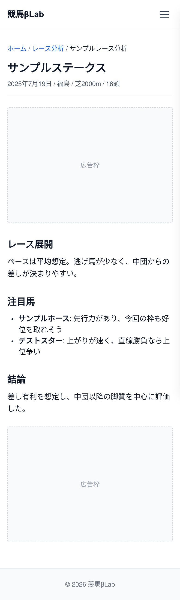

# UI設計：レース分析記事

上位文書: [画面設計書 §3.4](../../screen_design.md#34-レース分析一覧記事) / [本ディレクトリ README](../README.md)  
共通: [common.md](../common.md)  
関連: [一覧](./list.md)

## 1. 基本情報

| 項目 | 内容 |
| ---- | ---- |
| URL | `/analysis/{article_name}` |
| 説明 | 対象レースの分析記事を表示 |
| 対応コンポーネント | `AnalysisPost` |
| og:type | `article` |

## 2. レイアウト

* レース名・レース情報を上部に表示
* 分析本文（Markdown → HTML）を表示

**ワイヤーフレーム**
```
+--------------------------------------------------------+
|                        Header                          |
+--------------------------------------------------------+
|  レース名                                              |
|  レース情報                                            |
|                                                        |
|  +---------------------------------------------+      |
|  |                                             |      |
|  |  分析記事（Markdown）                        |      |
|  |                                             |      |
|  +---------------------------------------------+      |
+--------------------------------------------------------+
|                        Footer                          |
+--------------------------------------------------------+
```

<!-- ui-design-screenshot:begin -->

**実装スクリーンショット**（Storybook 自動撮影）



<!-- ui-design-screenshot:end -->


## 9. 変更履歴

| 日付 | 版 | 内容 | 担当 |
| ---- | -- | ---- | ---- |
| 2026-08-10 | 1.0 | 初版 | βshort |
| 2026-08-10 | 1.1 | home.md の粒度に合わせ、RaceDetail.drawio ベースのレイアウトに整理 | βshort |
| 2026-08-10 | 1.2 | 未定義だった「選択タブ」表記を削除 | βshort |
