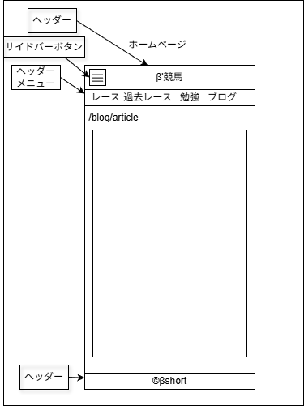

# UI設計：ブログ記事

上位文書: [画面設計書 §3.2](../../screen_design.md#32-ブログ一覧記事) / [本ディレクトリ README](../README.md)  
共通: [common.md](../common.md)  
関連: [一覧](./list.md)

## 1. 基本情報

| 項目 | 内容 |
| ---- | ---- |
| URL | `/blog/{article_name}` |
| 説明 | Markdown から変換された記事を表示 |
| 対応コンポーネント | `BlogPost` / `Breadcrumb` / `MetaTags` / `AdUnit` |
| データ | `src/articles/blog/{article_name}/index.md` |
| og:type | `article` |

## 2. レイアウト構成

```
Header
└─ Main
   ├─ パンくず（ホーム > ブログ > 記事タイトル）
   ├─ タイトル（h1・1ページに1つのみ）
   ├─ メタ情報（公開日 / カテゴリ / タグ）
   ├─ 広告枠（レイアウト固定領域）
   ├─ 本文（Markdown → HTML）
   └─ 広告枠（任意・所定位置）
Footer
```

## 3. UI要素一覧

| 項目 | 説明 |
| ---- | ---- |
| パンくずリスト | ホーム > ブログ > 記事タイトル |
| タイトル（h1） | 記事タイトル（1ページ1つのみ） |
| 公開日 | Front Matter の `date` |
| カテゴリ | 記事カテゴリ |
| タグ | 記事タグ（複数可） |
| 本文 | Markdown 変換 HTML |
| OGP画像 | 記事ごと（未設定時はデフォルト） |
| 広告 | Google Ads（レイアウト固定領域） |

## 4. インタラクション

- パンくず「ホーム」→ `/`
- パンくず「ブログ」→ `/blog`
- 記事未存在時は 404 相当表示（要実装）

## 5. 表示状態

| 状態 | 表示 |
| ---- | ---- |
| 通常 | 上記項目を表示 |
| 記事なし | 404 相当（文言・導線未決） |
| タグなし | タグ行を非表示 |
| 広告ブロック | 領域は確保したまま空でも可（許容） |

## 6. レスポンシブ

| 方針 | 内容 |
| ---- | ---- |
| 本文幅 | 可読性優先の最大幅（数値未決） |
| 画像 | 本文内画像は親幅にフィット |
| 広告 | 固定サイズ領域を維持し CLS を抑制 |

## 7. ワイヤー・モック参照



| 資産 | パス | 備考 |
| ---- | ---- | ---- |
| drawio | [KeibaBlog.drawio](./KeibaBlog.drawio) | 記事系ワイヤー |
| png | [KeibaBlog.png](./KeibaBlog.png) | 同上 |

## 8. 未決事項

- [ ] 広告の正確な挿入位置（タイトル下 / 本文中 / 末尾）
- [ ] 関連記事・前後記事ナビの要否
- [ ] 404 画面の共通化方針

## 9. 変更履歴

| 日付 | 版 | 内容 | 担当 |
| ---- | -- | ---- | ---- |
| 2026-08-10 | 1.0 | 初版 | βshort |
