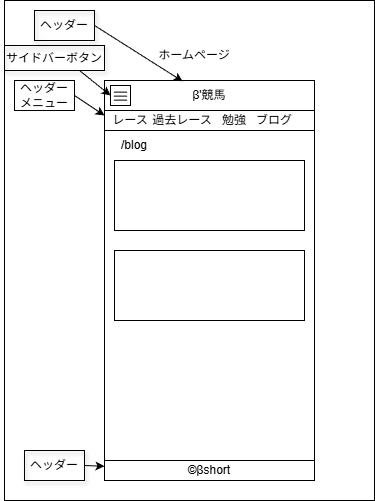

# UI設計：ブログ一覧

上位文書: [画面設計書 §3.2](../../screen_design.md#32-ブログ一覧記事) / [本ディレクトリ README](../README.md)  
共通: [common.md](../common.md)  
関連: [記事詳細](./article.md)

## 1. 基本情報

| 項目 | 内容 |
| ---- | ---- |
| URL | `/blog` |
| 説明 | ブログカテゴリの記事を新着順で一覧表示 |
| 対応コンポーネント | `BlogList` / `BlogCard` / `AdUnit`（所定位置） |
| データ | `src/articles/blog/**/index.md`（date 降順） |
| og:type | `website` |

## 2. レイアウト構成

```
Header
└─ Main
   ├─ ページ見出し（ブログ）
   ├─ パンくず（任意：ホーム > ブログ）
   ├─ 記事カード一覧（新着順）
   │  └─ BlogCard × N
   └─ 広告枠（任意・所定位置）
Footer
```

## 3. UI要素一覧

| 要素 | 必須 | 説明 |
| ---- | ---- | ---- |
| ページ見出し | ○ | 「ブログ」等 |
| サムネイル | △ | Front Matter `thumbnail`。未設定時はプレースホルダ or 非表示 |
| タイトル | ○ | 記事タイトル |
| 公開日 | ○ | Front Matter `date` |
| カテゴリ | ○ | 表示上はブログ固定、または Front Matter `category` |
| タグ | △ | 複数可。未設定時は非表示 |

## 4. インタラクション

- カード（またはタイトル）クリック → `/blog/{article_name}`
- タグクリックによる絞り込みは将来拡張（現状は表示のみ可）

## 5. 表示状態

| 状態 | 表示 |
| ---- | ---- |
| 通常 | 新着順カード一覧 |
| 記事 0 件 | 空状態メッセージ（文言未決） |
| サムネイルなし | プレースホルダ or テキストのみ（方針未決） |

## 6. レスポンシブ

| 方針 | 内容 |
| ---- | ---- |
| モバイル | 1 列カード |
| デスクトップ | 複数列グリッド（列数未決） |

## 7. ワイヤー・モック参照



| 資産 | パス | 備考 |
| ---- | ---- | ---- |
| drawio | [KeibaBlog_home.drawio](./KeibaBlog_home.drawio) | 一覧系ワイヤー |
| png | [KeibaBlog_home.png](./KeibaBlog_home.png) | 同上 |

## 8. 未決事項

- [ ] BlogCard の見た目（画像比率・日付フォーマット）
- [ ] ページネーション要否（現状は全件表示想定）
- [ ] 一覧での広告枠位置

## 9. 変更履歴

| 日付 | 版 | 内容 | 担当 |
| ---- | -- | ---- | ---- |
| 2026-08-10 | 1.0 | 初版 | βshort |
