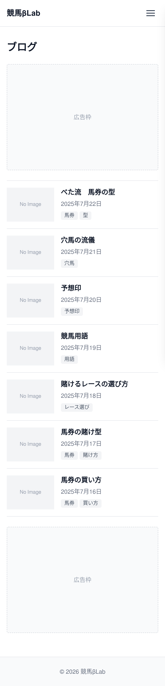

# UI設計：ブログ一覧

上位文書: [画面設計書 §3.2](../../screen_design.md#32-ブログ一覧記事) / [本ディレクトリ README](../README.md)  
共通: [common.md](../common.md)  
関連: [記事詳細](./article.md)

## 1. 基本情報

| 項目 | 内容 |
| ---- | ---- |
| URL | `/blog` |
| 説明 | ブログカテゴリの記事を新着順で一覧表示 |
| 対応コンポーネント | `BlogList` |
| og:type | `website` |

## 2. レイアウト

* ページ見出し「ブログ」を表示
* 記事カードを新着順で縦に一覧表示（サムネ・タイトル・公開日・タグ）
* 1ページあたり最大10件。11件目以降はページ下部のページネーションで切り替え
* カードタップで記事詳細へ遷移

**ワイヤーフレーム**
```
+--------------------------------------------------------+
|                        Header                          |
+--------------------------------------------------------+
|  ブログ                                              |
|                                                        |
|  +---------------------------------------------+      |
|  | サムネ  記事タイトル                         |      |
|  |         公開日 / タグ                        |      |
|  +---------------------------------------------+      |
|  +---------------------------------------------+      |
|  | サムネ  記事タイトル                         |      |
|  |         公開日 / タグ                        |      |
|  +---------------------------------------------+      |
|  | ...（最大10件・縦並び）                      |      |
|                                                        |
|  <  1  2  3  ...  >                                    |
+--------------------------------------------------------+
|                        Footer                          |
+--------------------------------------------------------+
```

<!-- ui-design-screenshot:begin -->

**実装スクリーンショット**（Storybook 自動撮影）



<!-- ui-design-screenshot:end -->


## 9. 変更履歴

| 日付 | 版 | 内容 | 担当 |
| ---- | -- | ---- | ---- |
| 2026-08-10 | 1.0 | 初版 | βshort |
| 2026-08-10 | 1.1 | home.md の粒度に合わせて簡素化 | βshort |
