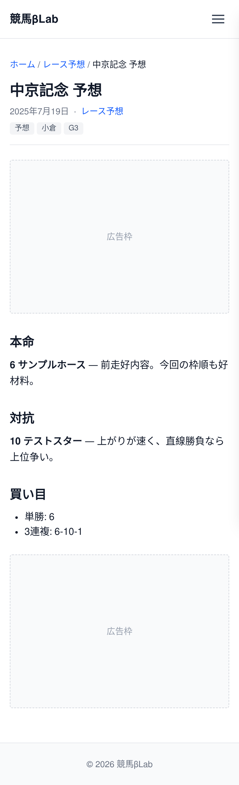

# UI設計：レース予想記事

上位文書: [画面設計書 §3.5](../../screen_design.md#35-レース予想一覧記事) / [本ディレクトリ README](../README.md)  
共通: [common.md](../common.md)  
関連: [一覧](./list.md)

## 1. 基本情報

| 項目 | 内容 |
| ---- | ---- |
| URL | `/predict/{article_name}` |
| 説明 | Markdown から変換されたレース予想記事を表示 |
| 対応コンポーネント | `PredictPost` |
| og:type | `article` |

## 2. レイアウト

* パンくず（ホーム > レース予想 > 記事タイトル）
* タイトル（h1）・公開日・カテゴリ・タグを表示
* 本文（Markdown → HTML）を表示
* 所定位置に広告枠を確保
* 構成は [ブログ記事](../blog/article.md) と同様（パンくずの親のみ異なる）

**ワイヤーフレーム**
```
+--------------------------------------------------------+
|                        Header                          |
+--------------------------------------------------------+
|  ホーム > レース予想 > 記事タイトル                    |
|                                                        |
|  記事タイトル（h1）                                    |
|  公開日 / カテゴリ / タグ                              |
|  +---------------------------------------------+      |
|  | 広告枠                                       |      |
|  +---------------------------------------------+      |
|  |                                             |      |
|  |  本文（Markdown）                            |      |
|  |                                             |      |
|  +---------------------------------------------+      |
+--------------------------------------------------------+
|                        Footer                          |
+--------------------------------------------------------+
```

<!-- ui-design-screenshot:begin -->

**実装スクリーンショット**（Storybook 自動撮影）



<!-- ui-design-screenshot:end -->

## 9. 変更履歴

| 日付 | 版 | 内容 | 担当 |
| ---- | -- | ---- | ---- |
| 2026-08-10 | 1.0 | 初版 | βshort |
| 2026-08-10 | 1.1 | home.md の粒度に合わせて簡素化 | βshort |
