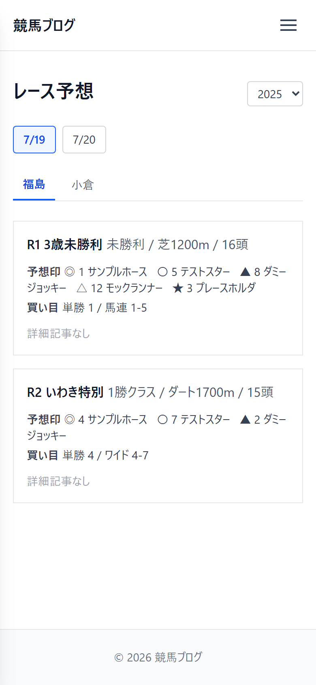

# UI設計：レース予想一覧

上位文書: [画面設計書 §3.5](../../screen_design.md#35-レース予想一覧記事) / [本ディレクトリ README](../README.md)  
共通: [common.md](../common.md)  
関連: [記事詳細](./article.md)

## 1. 基本情報

| 項目 | 内容 |
| ---- | ---- |
| URL | `/predict` |
| 説明 | 開催日・競馬場単位でレース予想を一覧表示。詳細記事がある場合は記事へ遷移 |
| 対応コンポーネント | `PredictList` |
| og:type | `website` |

## 2. レイアウト

* 年・開催日の切り替えで対象日を選ぶ
* 競馬場タブで場を切り替える
* 選択した日・場のレース一覧を表示
* レース行には以下の情報を表示する
  * レース番号, クラス, レース名, コース, 頭数
  * 予想印
    * ◎, 〇, ▲, △, ★
  * 買い目
    * 単勝など
* 詳細記事があれば、リンクで遷移する

**ワイヤーフレーム**
```
+--------------------------------------------------------+
|                        Header                          |
+--------------------------------------------------------+
|  レース予想                              2025          |
|                                                        |
|  <  [ 7/19 ]  [ 7/20 ]  ...  >                         |
|                                                        |
|  [ 福島 ] [ 小倉 ] [ 函館 ]                            |
|  +---------------------------------------------+      |
|  | R1  レース名  クラス  コース  頭数           |      |
|  | 予想印  ◎ 〇 ▲ △ ★                         |      |
|  | 買い目  単勝 ...                            |      |
|  | [詳細記事へ]                                |      |
|  +---------------------------------------------+      |
|  | R2  レース名  クラス  コース  頭数           |      |
|  | 予想印  ◎ 〇 ▲ △ ★                         |      |
|  | 買い目  単勝 ...                            |      |
|  | （詳細記事なし）                            |      |
|  +---------------------------------------------+      |
|  | ...                                         |      |
+--------------------------------------------------------+
|                        Footer                          |
+--------------------------------------------------------+
```

<!-- ui-design-screenshot:begin -->

**実装スクリーンショット**（Storybook 自動撮影）



<!-- ui-design-screenshot:end -->


## 9. 変更履歴

| 日付 | 版 | 内容 | 担当 |
| ---- | -- | ---- | ---- |
| 2026-08-10 | 1.0 | 初版 | βshort |
| 2026-08-10 | 1.1 | home.md の粒度に合わせて簡素化 | βshort |
| 2026-08-10 | 1.2 | レイアウト記述に合わせてワイヤーフレームを更新（予想印・買い目） | βshort |
| 2026-08-10 | 1.3 | 詳細記事リンクをワイヤーフレームに反映 | βshort |
| 2026-08-10 | 1.4 | 基本情報の説明をレイアウト（開催日・場単位）に合わせて修正 | βshort |
