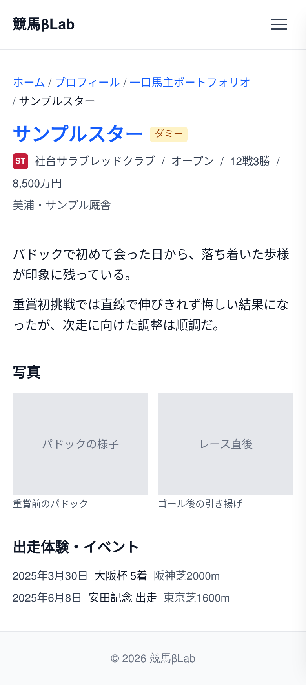

# UI設計：愛馬日記

上位文書: [画面設計書 §3.6.1.1](../../screen_design.md#3611-愛馬日記) / [本ディレクトリ README](../README.md)  
共通: [common.md](../common.md)  
関連: [一口馬主ポートフォリオ](./hitokuchi-portfolio.md)

## 1. 基本情報

| 項目 | 内容 |
| ---- | ---- |
| URL | `/profile/hitokuchi-portfolio/{bamei}` |
| 説明 | 出資馬ごとの日記・観戦記・思い出を記録・表示する |
| 対応コンポーネント | `AibaDiary` |
| og:type | `article` |

## 2. レイアウト

* パンくず（ホーム > プロフィール > 一口馬主ポートフォリオ > 馬名）
* 対象馬の見出し（馬名）と関連馬情報（所属クラブ・戦績などへのリンク／簡易表示）を上部に表示
* 投稿詳細を自由形式で表示
  * 本文（Markdown 等）
  * 写真
  * 関連する出走・イベントなどの記述
* 一口馬主ポートフォリオ一覧からのリンクで遷移する

**ワイヤーフレーム**
```
+--------------------------------------------------------+
|                        Header                          |
+--------------------------------------------------------+
|  ホーム > プロフィール > 一口馬主ポートフォリオ > 馬名   |
|                                                        |
|  馬名（h1）                                            |
|  所属クラブ / 戦績（関連馬情報）                       |
|                                                        |
|  +---------------------------------------------+      |
|  |  本文（日記・観戦記・思い出）                 |      |
|  |                                             |      |
|  |  [ 写真 ]  [ 写真 ]                         |      |
|  |                                             |      |
|  |  出走体験・イベントなど                      |      |
|  +---------------------------------------------+      |
+--------------------------------------------------------+
|                        Footer                          |
+--------------------------------------------------------+
```

<!-- ui-design-screenshot:begin -->

**実装スクリーンショット**（Storybook 自動撮影）



<!-- ui-design-screenshot:end -->


## 9. 変更履歴

| 日付 | 版 | 内容 | 担当 |
| ---- | -- | ---- | ---- |
| 2026-08-13 | 1.0 | 初版 | βshort |
| 2026-08-13 | 1.1 | 文書名を aiba-nikki.md から aiba-diary.md に変更。対応コンポーネントを AibaDiary に変更 | βshort |
