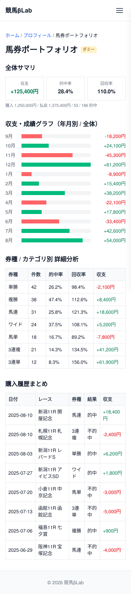

# UI設計：馬券ポートフォリオ

上位文書: [画面設計書 §3.6.2](../../screen_design.md#362-馬券ポートフォリオ) / [本ディレクトリ README](../README.md)  
共通: [common.md](../common.md)  
関連: [プロフィール](./profile.md)

## 1. 基本情報

| 項目 | 内容 |
| ---- | ---- |
| URL | `/profile/baken-portfolio` |
| 説明 | 馬券成績（収支・的中率・回収率など）や購入傾向を集計し可視化する |
| 対応コンポーネント | `BakenPortfolio` |
| og:type | `website` |

## 2. レイアウト

* パンくず（ホーム > プロフィール > 馬券ポートフォリオ）
* ページ見出し「馬券ポートフォリオ」を表示
* 全体サマリを表示
  * 収支・的中率・回収率など
* 年月別および全体の収支・成績グラフを表示
* 券種／カテゴリ別の詳細分析を表示
* 購入履歴まとめを表示

**ワイヤーフレーム**
```
+--------------------------------------------------------+
|                        Header                          |
+--------------------------------------------------------+
|  ホーム > プロフィール > 馬券ポートフォリオ              |
|                                                        |
|  馬券ポートフォリオ                                    |
|                                                        |
|  +--------- 全体サマリ --------+                       |
|  | 収支 / 的中率 / 回収率      |                       |
|  +-----------------------------+                       |
|                                                        |
|  収支・成績グラフ（年月別 / 全体）                      |
|  +---------------------------------------------+      |
|  |            [ グラフ領域 ]                    |      |
|  +---------------------------------------------+      |
|                                                        |
|  券種 / カテゴリ別 詳細分析                             |
|  +---------------------------------------------+      |
|  | 券種A  的中率 / 回収率 / 件数 ...            |      |
|  | 券種B  的中率 / 回収率 / 件数 ...            |      |
|  | ...                                         |      |
|  +---------------------------------------------+      |
|                                                        |
|  購入履歴まとめ                                        |
|  +---------------------------------------------+      |
|  | 日付 / レース / 券種 / 結果 / 収支 ...       |      |
|  | ...                                         |      |
|  +---------------------------------------------+      |
+--------------------------------------------------------+
|                        Footer                          |
+--------------------------------------------------------+
```

<!-- ui-design-screenshot:begin -->

**実装スクリーンショット**（Storybook 自動撮影）



<!-- ui-design-screenshot:end -->


## 9. 変更履歴

| 日付 | 版 | 内容 | 担当 |
| ---- | -- | ---- | ---- |
| 2026-08-13 | 1.0 | 初版 | βshort |
