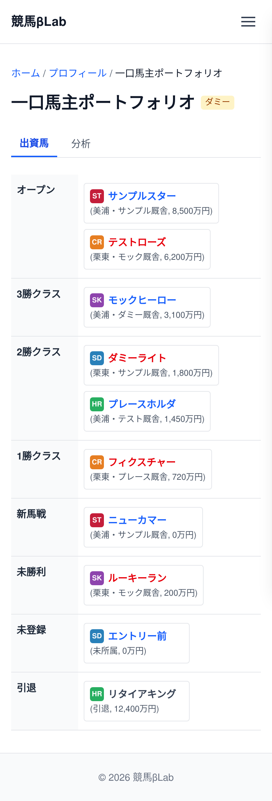

# UI設計：一口馬主ポートフォリオ

上位文書: [画面設計書 §3.6.1](../../screen_design.md#361-一口馬主ポートフォリオ) / [本ディレクトリ README](../README.md)  
共通: [common.md](../common.md)  
関連: [プロフィール](./profile.md) / [愛馬日記](./aiba-diary.md)

## 1. 基本情報

| 項目 | 内容 |
| ---- | ---- |
| URL | `/profile/hitokuchi-portfolio` |
| 説明 | 一口馬主（クラブ馬）の保有状況を一覧・可視化する |
| 対応コンポーネント | `HitokuchiPortfolio` |
| og:type | `website` |

## 2. レイアウト

* パンくず（ホーム > プロフィール > 一口馬主ポートフォリオ）
* ページ見出し「一口馬主ポートフォリオ」を表示
* 以下のポートフォリオをタブで切り替え表示する。
  * 出資馬
  * 分析
* 出資馬を表で一覧表示
  * 8x2(1列目はindex名)のマトリクスで表示する
    * 行はクラス
      * オープン・3勝クラス・2勝クラス・1勝クラス・新馬戦・未勝利・未登録・引退
    * セルは、馬名+所属クラブのマーク+情報を表示する
      * 馬名は、牡馬: 青色、牝馬: 赤色の文字色で表示する
      * 馬名の前に所属クラブのマークを表示する(所属クラブマークは後で画像を用意する)
      * 情報は、馬名の下に(所属厩舎, 獲得賞金)を表示する
      * 馬名はリンクで、クリックすると愛馬日記（`/profile/hitokuchi-portfolio/{bamei}`）へ遷移する
* 分析を表示する
  * 未定のためダミーを表示する

**ワイヤーフレーム**
```
+--------------------------------------------------------+
|                        Header                          |
+--------------------------------------------------------+
|  ホーム > プロフィール > 一口馬主ポートフォリオ          |
|                                                        |
|  一口馬主ポートフォリオ                                |
|                                                        |
|  [ 出資馬 ]  [ 分析 ]                                  |
|                                                        |
|  --- タブ: 出資馬 ---                                  |
|  （8×2 マトリクス・1列目＝クラス名 / 2列目＝馬セル）    |
|  +------------+--------------------------------------+ |
|  | オープン   | [CL]馬名A  [CL]馬名B  ...            | |
|  |            | (厩舎,賞金) (厩舎,賞金)               | |
|  +------------+--------------------------------------+ |
|  | 3勝クラス  | [CL]馬名  ...                        | |
|  +------------+--------------------------------------+ |
|  | 2勝クラス  | [CL]馬名  ...                        | |
|  +------------+--------------------------------------+ |
|  | 1勝クラス  | [CL]馬名  ...                        | |
|  +------------+--------------------------------------+ |
|  | 新馬戦     | [CL]馬名  ...                        | |
|  +------------+--------------------------------------+ |
|  | 未勝利     | [CL]馬名  ...                        | |
|  +------------+--------------------------------------+ |
|  | 未登録     | [CL]馬名  ...                        | |
|  +------------+--------------------------------------+ |
|  | 引退       | [CL]馬名  ...                        | |
|  +------------+--------------------------------------+ |
|                                                        |
|  ※ 馬名リンク → 愛馬日記                               |
|  ※ 牡馬: 青文字 / 牝馬: 赤文字                         |
|  ※ [CL] = 所属クラブマーク（画像は別途用意）           |
|                                                        |
|  --- タブ: 分析 ---                                    |
|  +--------------------------------------------------+ |
|  |  （未定・ダミー表示）                              | |
|  +--------------------------------------------------+ |
+--------------------------------------------------------+
|                        Footer                          |
+--------------------------------------------------------+
```

<!-- ui-design-screenshot:begin -->

**実装スクリーンショット**（Storybook 自動撮影）



<!-- ui-design-screenshot:end -->


## 9. 変更履歴

| 日付 | 版 | 内容 | 担当 |
| ---- | -- | ---- | ---- |
| 2026-08-13 | 1.0 | 初版 | βshort |
| 2026-08-13 | 1.1 | レイアウト（タブ＋クラス別マトリクス）に合わせてワイヤーを更新 | βshort |
| 2026-08-13 | 1.2 | 8×2マトリクス・分析タブ（ダミー）に合わせてワイヤーを更新 | βshort |
| 2026-08-13 | 1.3 | 愛馬日記の文書名を aiba-diary.md に変更 | βshort |
