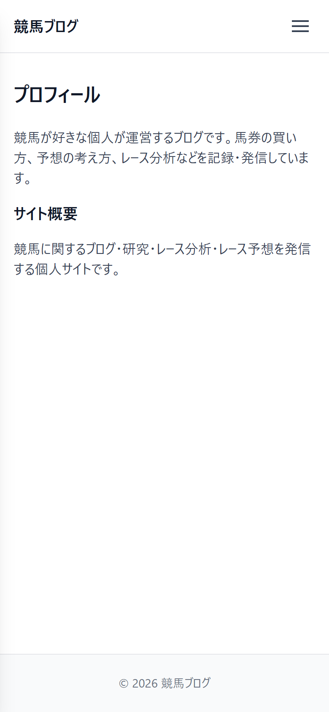

# UI設計：プロフィール

上位文書: [画面設計書 §3.6](../../screen_design.md#36-プロフィール) / [本ディレクトリ README](../README.md)  
共通: [common.md](../common.md)

## 1. 基本情報

| 項目 | 内容 |
| ---- | ---- |
| URL | `/profile` |
| 説明 | 運営者の自己紹介を表示 |
| 対応コンポーネント | `Profile` |
| og:type | `website` |

## 2. レイアウト

* ページ見出し「プロフィール」を表示
* プロフィール本文を表示
* サイト概要を表示

**ワイヤーフレーム**
```
+--------------------------------------------------------+
|                        Header                          |
+--------------------------------------------------------+
|  プロフィール                                          |
|                                                        |
|  プロフィール本文                                      |
|                                                        |
|  サイト概要                                            |
+--------------------------------------------------------+
|                        Footer                          |
+--------------------------------------------------------+
```

<!-- ui-design-screenshot:begin -->

**実装スクリーンショット**（Storybook 自動撮影）



<!-- ui-design-screenshot:end -->


## 9. 変更履歴

| 日付 | 版 | 内容 | 担当 |
| ---- | -- | ---- | ---- |
| 2026-08-10 | 1.0 | 初版 | βshort |
| 2026-08-10 | 1.1 | home.md の粒度に合わせて簡素化 | βshort |
