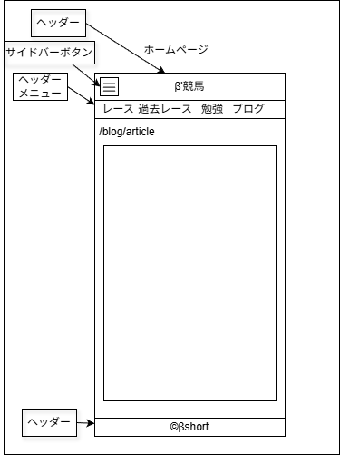

# UI設計：競馬研究記事

上位文書: [画面設計書 §3.3](../../screen_design.md#33-競馬研究一覧記事) / [本ディレクトリ README](../README.md)  
共通: [common.md](../common.md)  
関連: [一覧](./list.md)  
ベース: 説明・表示項目は [ブログ記事](../blog/article.md) と同様。パンくずの親を「競馬研究」とする

## 1. 基本情報

| 項目 | 内容 |
| ---- | ---- |
| URL | `/study/{article_name}` |
| 説明 | Markdown から変換された研究記事を表示 |
| 対応コンポーネント | `StudyPost` / `Breadcrumb` / `MetaTags` / `AdUnit` |
| データ | `src/articles/study/{article_name}/index.md` |
| og:type | `article` |

## 2. レイアウト構成

ブログ記事と同様

## 3. UI要素一覧

| 項目 | 説明 |
| ---- | ---- |
| パンくずリスト | ホーム > 競馬研究 > 記事タイトル |
| タイトル（h1） | 記事タイトル（1ページ1つのみ） |
| 公開日 | Front Matter の `date` |
| カテゴリ | 記事カテゴリ |
| タグ | 記事タグ（複数可） |
| 本文 | Markdown 変換 HTML |
| OGP画像 | 記事ごと（未設定時はデフォルト） |
| 広告 | Google Ads（レイアウト固定領域） |

## 4. インタラクション

- パンくず「ホーム」→ `/`
- パンくず「競馬研究」→ `/study`

## 5. 表示状態 / 6. レスポンシブ

ブログ記事と同様

## 7. ワイヤー・モック参照

| 資産 | パス | 備考 |
| ---- | ---- | ---- |
| drawio | [KeibaStudyRoom.drawio](./KeibaStudyRoom.drawio) | 記事系ワイヤー |
| png | [KeibaStudyRoom.png](./KeibaStudyRoom.png) | 同上 |

## 8. 未決事項

- [ ] 研究記事固有の UI（図表・注釈スタイル等）の要否

## 9. 変更履歴

| 日付 | 版 | 内容 | 担当 |
| ---- | -- | ---- | ---- |
| 2026-08-10 | 1.0 | 初版 | βshort |
