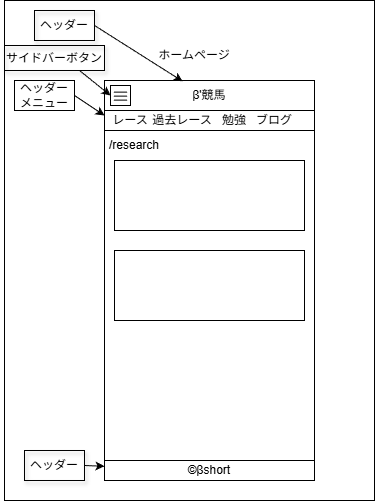

# UI設計：競馬研究一覧

上位文書: [画面設計書 §3.3](../../screen_design.md#33-競馬研究一覧記事) / [本ディレクトリ README](../README.md)  
共通: [common.md](../common.md)  
関連: [記事詳細](./article.md)  
ベース: 表示項目・構成は [ブログ一覧](../blog/list.md) と同様

## 1. 基本情報

| 項目 | 内容 |
| ---- | ---- |
| URL | `/study` |
| 説明 | 研究カテゴリの記事を新着順で一覧表示 |
| 対応コンポーネント | `StudyList` / `BlogCard` / `AdUnit`（所定位置） |
| データ | `src/articles/study/**/index.md`（date 降順） |
| og:type | `website` |

## 2. レイアウト構成

```
Header
└─ Main
   ├─ ページ見出し（競馬研究）
   ├─ パンくず（任意：ホーム > 競馬研究）
   ├─ 記事カード一覧（新着順）
   └─ 広告枠（任意・所定位置）
Footer
```

## 3. UI要素一覧

ブログ一覧と同様：サムネイル、タイトル、公開日、カテゴリ、タグ（任意）

## 4. インタラクション

- カードクリック → `/study/{article_name}`

## 5. 表示状態

ブログ一覧と同様（通常 / 0 件 / サムネイルなし）

## 6. レスポンシブ

ブログ一覧と同様

## 7. ワイヤー・モック参照



| 資産 | パス | 備考 |
| ---- | ---- | ---- |
| drawio | [KeibaStudyRoom_home.drawio](./KeibaStudyRoom_home.drawio) | 一覧系ワイヤー |
| png | [KeibaStudyRoom_home.png](./KeibaStudyRoom_home.png) | 同上 |

## 8. 未決事項

- [ ] ブログ一覧と見た目を完全共通化するか、カテゴリ別の差し色のみ変えるか

## 9. 変更履歴

| 日付 | 版 | 内容 | 担当 |
| ---- | -- | ---- | ---- |
| 2026-08-10 | 1.0 | 初版 | βshort |
