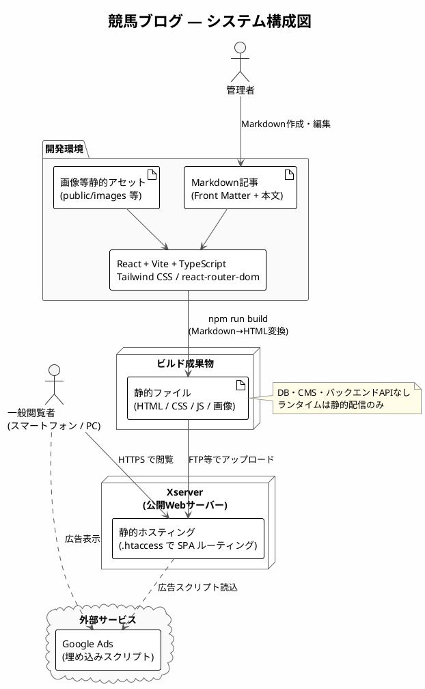

# アーキテクチャ設計書（競馬ブログ）

上位文書: [要件定義書（specification.md）](../02_specification/specification.md)  
関連文書: [画面設計書](./screen_design.md) / [機能コンポーネント設計書](./component_design.md)

1. [1. はじめに](#1-はじめに)
   1. [1.1 目的](#11-目的)
   2. [1.2 対象読者](#12-対象読者)
   3. [1.3 用語・略語](#13-用語略語)
2. [2. システム概要](#2-システム概要)
   1. [2.1 システムの位置づけ](#21-システムの位置づけ)
   2. [2.2 システム構成図](#22-システム構成図)
   3. [2.3 処理概要](#23-処理概要)
3. [3. 設計方針](#3-設計方針)
   1. [3.1 設計方針](#31-設計方針)
   2. [3.2 使用技術](#32-使用技術)
   3. [3.3 命名規則](#33-命名規則)
4. [4. データ設計](#4-データ設計)
   1. [4.1 データ管理方針](#41-データ管理方針)
   2. [4.2 Front Matter定義](#42-front-matter定義)
   3. [4.3 フォルダ構成](#43-フォルダ構成)
5. [5. API設計](#5-api設計)
6. [6. 非機能設計](#6-非機能設計)
   1. [6.1 性能](#61-性能)
   2. [6.2 可用性](#62-可用性)
   3. [6.3 セキュリティ](#63-セキュリティ)
   4. [6.4 保守性・拡張性](#64-保守性拡張性)
   5. [6.5 SEO](#65-seo)
   6. [6.6 OGP・SNS連携](#66-ogpsns連携)
   7. [6.7 広告・クローラ対応](#67-広告クローラ対応)
7. [7. テスト観点（設計レベル）](#7-テスト観点設計レベル)
   1. [7.1 単体テスト観点](#71-単体テスト観点)
   2. [7.2 結合テスト観点](#72-結合テスト観点)
8. [8. デプロイ設計](#8-デプロイ設計)
   1. [8.1 デプロイ先](#81-デプロイ先)
   2. [8.2 ビルド・デプロイ手順](#82-ビルドデプロイ手順)
   3. [8.3 サーバー設定](#83-サーバー設定)
9. [9. 変更履歴](#9-変更履歴)

<div style="page-break-after: always;"></div>

## 1. はじめに

### 1.1 目的

本書は、競馬ブログシステムのアーキテクチャ（システム構成・データ・非機能・デプロイ）を明確にし、  
開発・テスト・保守を円滑に進めることを目的とする。

### 1.2 対象読者

- 開発者
- テスター
- プロジェクト管理者
- 保守担当者

### 1.3 用語・略語

| 用語         | 説明                                   |
| ------------ | -------------------------------------- |
| Markdown     | 記事作成に使用する軽量マークアップ言語 |
| OGP          | SNS共有時に表示されるメタ情報          |
| Twitter Card | X（旧Twitter）用OGP拡張                |
| Front Matter | Markdown先頭のYAML形式メタ情報         |
| LCP          | Largest Contentful Paint（最大コンテンツ描画時間） |
| CLS          | Cumulative Layout Shift（累積レイアウトシフト） |

<div style="page-break-after: always;"></div>

## 2. システム概要

### 2.1 システムの位置づけ

- 個人運営の競馬ブログサイト
- Webブラウザから閲覧する情報提供サイト
- 静的ビルドを前提とし、DB・CMS・ユーザー投稿機能は持たない

### 2.2 システム構成図

出典: [system_architecture.puml](./diagrams/system_architecture.puml)



外部連携：

- Google Ads：埋め込みスクリプトによる広告表示

### 2.3 処理概要

- Markdownで記事を作成
- ビルド時にMarkdownをHTMLへ変換
- 変換したHTMLを記事ページ・一覧ページに表示
- 静的ファイルとしてXserverへデプロイ

<div style="page-break-after: always;"></div>

## 3. 設計方針

### 3.1 設計方針

- スマートフォン閲覧を前提としたモバイルファースト設計
- 静的ビルドによる高速表示・24時間閲覧可能な構成
- 記事はMarkdownファイルで管理し、追加・修正が容易な構成
- カテゴリ・タグは拡張可能なFront Matter設計
- SEO・OGPを記事単位で管理可能とする
- 障害時は再ビルド・再デプロイで復旧可能とする

### 3.2 使用技術

| 区分           | 技術            |
| -------------- | --------------- |
| フロントエンド | React           |
| ビルドツール   | Vite            |
| 言語           | TypeScript      |
| UI             | Tailwind CSS    |
| ルーティング   | react-router-dom |
| 記事管理       | Markdown        |
| Front Matter解析 | gray-matter   |
| Markdown変換   | marked          |
| メタ情報       | react-helmet-async（想定） |
| デプロイ先     | Xserver         |

### 3.3 命名規則

| 対象             | 規則        | 例              |
| ---------------- | ----------- | --------------- |
| Reactコンポーネント | PascalCase | `BlogPost.tsx`  |
| ファイル名（コンポーネント以外） | camelCase | `markdown.ts`   |
| 記事フォルダ名   | kebab-case  | `howtobet-baken` |
| URLスラッグ      | kebab-case  | `/blog/howtobet-baken` |

<div style="page-break-after: always;"></div>

## 4. データ設計

※本システムはDBを使用しない

### 4.1 データ管理方針

- 記事データは Markdown ファイルで管理
- 画像は記事フォルダ配下または `public/images/` に配置
- ビルド時にファイルを読み込み、ランタイムでは静的データとして扱う

### 4.2 Front Matter定義

```yaml
---
title: "記事タイトル"           # 必須。ページh1・og:titleに使用
date: "2025-07-16"              # 必須。一覧のソート・表示に使用
description: "記事の要約"       # 推奨。meta description・og:descriptionに使用
category: "blog"                # 必須。blog | study | analysis | predict
tags: ["競馬", "予想"]          # 任意。配列
thumbnail: "/images/.../thumb.jpg"  # 任意。一覧サムネイル
ogImage: "/images/.../og.jpg"       # 任意。未設定時はデフォルトOGP画像
noindex: false                  # 任意。将来拡張：trueでnoindex
---
```

### 4.3 フォルダ構成

```txt
keiba-blog/
├─ public/
│  ├─ images/              # 記事画像・OGPデフォルト画像
│  ├─ robots.txt
│  └─ ...
├─ src/
│  ├─ articles/
│  │  ├─ blog/
│  │  │  └─ {article_name}/
│  │  │     ├─ index.md
│  │  │     └─ hero.png    # 記事専用画像（任意）
│  │  ├─ study/
│  │  │  └─ {article_name}/
│  │  │     ├─ index.md
│  │  │     └─ hero.png
│  │  ├─ analysis/
│  │  │  └─ {article_name}/
│  │  │     ├─ index.md
│  │  │     └─ hero.png
│  │  └─ predict/
│  │     └─ {article_name}/
│  │        ├─ index.md
│  │        └─ hero.png
│  ├─ component/
│  ├─ pages/
│  ├─ utils/
│  │  └─ markdown.ts       # 読込・変換・ソート
│  ├─ App.tsx
│  └─ main.tsx
├─ dist/                   # ビルド成果物（デプロイ対象）
└─ vite.config.ts
```

<div style="page-break-after: always;"></div>

## 5. API設計

本システムではバックエンドAPIは使用しない。  
記事取得・変換はすべてビルド時／クライアント側の静的処理で完結する。

<div style="page-break-after: always;"></div>

## 6. 非機能設計

### 6.1 性能

| 項目     | 設計内容                                       |
| -------- | ---------------------------------------------- |
| LCP      | 2.5秒以内を目標。画像の適切なサイズ・形式を使用 |
| 初回表示 | Vite によるコード分割・静的配信で高速化         |
| 一覧表示 | モバイル環境での高速表示を優先                   |

### 6.2 可用性

- 静的サイトとして Xserver 上で 24 時間閲覧可能とする
- 障害時はソースから再ビルド・再デプロイで復旧
- ランタイムのサーバー処理に依存しない構成

### 6.3 セキュリティ

- コメント等のユーザー入力機能は提供しない
- `dangerouslySetInnerHTML` の入力元は管理者作成 Markdown のみ
- 外部スクリプトは Google Ads 等、信頼されたもののみ利用
- CMS・認証機能は対象外

### 6.4 保守性・拡張性

- 記事追加：Markdown ファイルを所定フォルダに配置するだけで反映可能
- カテゴリ・タグ：Front Matter の追加・変更で拡張
- SEO・OGP：記事単位の Front Matter で管理
- `noindex` / `nofollow`：Front Matter フラグで将来対応可能な設計

### 6.5 SEO

| 要件                     | 設計対応                                           |
| ------------------------ | -------------------------------------------------- |
| title / meta description | MetaTags コンポーネントでページ・記事単位に設定    |
| 見出し構造               | Markdown 内で h2〜h3 を論理階層に。h1 はタイトルのみ1つ |
| パンくずリスト           | Breadcrumb コンポーネントを記事ページに設置        |
| URL形式                  | `/blog/{article_name}`, `/study/{article_name}`, `/analysis/{article_name}`, `/predict/{article_name}` |
| モバイルファースト       | Tailwind CSS のレスポンシブ設計                    |
| noindex制御              | Front Matter `noindex`（将来実装）                 |
| sitemap.xml              | ビルド時または手動で生成し public に配置           |
| robots.txt               | public/robots.txt に配置                           |

### 6.6 OGP・SNS連携

| タグ / 要件              | 設計対応                              |
| ------------------------ | ------------------------------------- |
| og:title                 | 記事 title / サイト名                 |
| og:description           | 記事 description / サイト説明         |
| og:type                  | article（記事）/ website（その他）    |
| og:url                   | 現在ページの絶対URL                   |
| og:image                 | ogImage またはデフォルト画像の絶対URL |
| og:site_name             | サイト固定名                          |
| Twitter Card             | summary_large_image                   |

### 6.7 広告・クローラ対応

- Google Ads：AdUnit コンポーネントで所定位置に埋め込み
- CLS抑制：広告枠に min-height を指定し読み込み前のレイアウトを固定
- robots.txt：`public/robots.txt`
- sitemap.xml：全公開URLを列挙（ビルドスクリプトまたは手動更新）

<div style="page-break-after: always;"></div>

## 7. テスト観点（設計レベル）

### 7.1 単体テスト観点

- Markdown → HTML 変換結果（見出し・リンク・コードブロック）
- Front Matter 解析（必須項目欠落時のフォールバック）
- 日付ソート（新着順）の正しさ
- URLスラッグと記事フォルダ名の対応

### 7.2 結合テスト観点

- 記事一覧 → 記事詳細への遷移（/blog, /study, /analysis, /predict）
- SEO：title / meta description が記事ごとにユニークであること
- OGP・Twitter Card タグが記事・一覧・ホームで正しく出力されること
- パンくずリストの階層が正しいこと
- h1 が各ページに1つのみであること
- 広告表示領域のレイアウトシフトが許容範囲内であること
- robots.txt / sitemap.xml が配信されること

**受入条件（仕様書より）**

- 記事一覧・記事ページが正しく表示されること
- SEO・OGP設定が反映されていること

<div style="page-break-after: always;"></div>

## 8. デプロイ設計

### 8.1 デプロイ先

- Xserver（静的ファイルホスティング）

### 8.2 ビルド・デプロイ手順

1. `npm run build` で `dist/` を生成
2. `dist/` 配下を Xserver の公開ディレクトリへアップロード
3. `robots.txt` / `sitemap.xml` / 画像が含まれることを確認
4. ブラウザで主要ページの表示・OGPを確認

### 8.3 サーバー設定

SPA ルーティング用 `.htaccess`（Xserver / Apache）：

```txt
RewriteEngine On
RewriteCond %{REQUEST_FILENAME} !-f
RewriteCond %{REQUEST_FILENAME} !-d
RewriteRule ^ index.html [L]
```

<div style="page-break-after: always;"></div>

## 9. 変更履歴

| 日付       | 版  | 内容                                       | 担当   |
| ---------- | --- | ------------------------------------------ | ------ |
| 2026-02-02 | 1.0 | 初版作成（設計書として）                   | βshort |
| 2026-05-23 | 1.1 | 仕様書（specification.md）に基づき全体を更新 | βshort |
| 2026-05-23 | 1.2 | 関連ドキュメント・各種ID・優先度・トレーサビリティを削除 | βshort |
| 2026-05-23 | 1.3 | レース分析・レース予想の画面・ルーティング・データ設計を追加 | βshort |
| 2026-08-10 | 2.0 | design.md からアーキテクチャ設計書として分割 | βshort |
| 2026-08-10 | 2.1 | システム構成図を PlantUML 化 | βshort |
