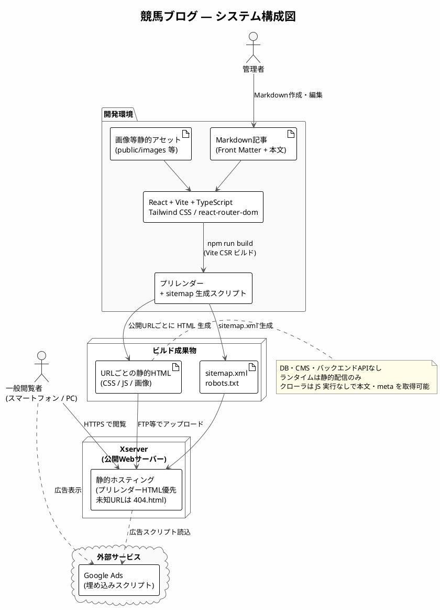
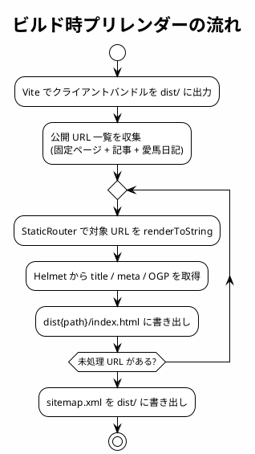

# アーキテクチャ設計書（競馬ブログ）

上位文書: [要件定義書（specification.md）](../02_specification/specification.md)  
関連文書: [画面設計書](./screen_design.md) / [機能コンポーネント設計書](./component_design.md)

1. [1. はじめに](#1-はじめに)
   1. [1.1 目的](#11-目的)
   2. [1.2 対象読者](#12-対象読者)
   3. [1.3 用語・略語](#13-用語略語)
2. [2. システム概要](#2-システム概要)
   1. [2.1 システムの位置づけ](#21-システムの位置づけ)
   2. [2.2 システム構成図](#22-システム構成図)
   3. [2.3 処理概要](#23-処理概要)
3. [3. 設計方針](#3-設計方針)
   1. [3.1 設計方針](#31-設計方針)
   2. [3.2 使用技術](#32-使用技術)
   3. [3.3 命名規則](#33-命名規則)
   4. [3.4 レンダリング方式](#34-レンダリング方式)
      1. [3.4.1 Vite + React 維持](#341-vite--react-維持)
      2. [3.4.2 ビルド時プリレンダー](#342-ビルド時プリレンダー)
      3. [3.4.3 sitemap 生成](#343-sitemap-生成)
4. [4. データ設計](#4-データ設計)
   1. [4.1 データ管理方針](#41-データ管理方針)
   2. [4.2 Front Matter定義](#42-front-matter定義)
   3. [4.3 フォルダ構成](#43-フォルダ構成)
5. [5. API設計](#5-api設計)
6. [6. 非機能設計](#6-非機能設計)
   1. [6.1 性能](#61-性能)
   2. [6.2 可用性](#62-可用性)
   3. [6.3 セキュリティ](#63-セキュリティ)
   4. [6.4 保守性・拡張性](#64-保守性拡張性)
   5. [6.5 SEO](#65-seo)
   6. [6.6 OGP・SNS連携](#66-ogpsns連携)
   7. [6.7 広告・クローラ対応](#67-広告クローラ対応)
7. [7. テスト観点（設計レベル）](#7-テスト観点設計レベル)
   1. [7.1 単体テスト観点](#71-単体テスト観点)
   2. [7.2 結合テスト観点](#72-結合テスト観点)
8. [8. デプロイ設計](#8-デプロイ設計)
   1. [8.1 デプロイ先](#81-デプロイ先)
   2. [8.2 ビルド・デプロイ手順](#82-ビルドデプロイ手順)
   3. [8.3 サーバー設定](#83-サーバー設定)
   4. [8.4 ビルド成果物](#84-ビルド成果物)
9. [9. 変更履歴](#9-変更履歴)

<div style="page-break-after: always;"></div>

## 1. はじめに

### 1.1 目的

本書は、競馬ブログシステムのアーキテクチャ（システム構成・データ・非機能・デプロイ）を明確にし、  
開発・テスト・保守を円滑に進めることを目的とする。

### 1.2 対象読者

- 開発者
- テスター
- プロジェクト管理者
- 保守担当者

### 1.3 用語・略語

| 用語         | 説明                                   |
| ------------ | -------------------------------------- |
| Markdown     | 記事作成に使用する軽量マークアップ言語 |
| OGP          | SNS共有時に表示されるメタ情報          |
| Twitter Card | X（旧Twitter）用OGP拡張                |
| Front Matter | Markdown先頭のYAML形式メタ情報         |
| LCP          | Largest Contentful Paint（最大コンテンツ描画時間） |
| CLS          | Cumulative Layout Shift（累積レイアウトシフト） |
| CSR          | Client-Side Rendering。ブラウザ上の JS で画面を描画する方式 |
| プリレンダー | ビルド時に各 URL の HTML を事前生成すること（SSG 相当） |
| ハイドレーション | 事前生成 HTML にクライアント JS を結び付け、以降は SPA として動かすこと |
| SITE_ORIGIN  | 公開サイトのオリジン（例: `https://example.com`）。OGP・sitemap の絶対 URL に使用 |

<div style="page-break-after: always;"></div>

## 2. システム概要

### 2.1 システムの位置づけ

- 個人運営の競馬ブログサイト
- Webブラウザから閲覧する情報提供サイト
- 静的ビルド（ビルド時プリレンダー）を前提とし、DB・CMS・ユーザー投稿機能は持たない
- 公開サーバーにアプリケーションランタイム（Node 等）は置かない

### 2.2 システム構成図



外部連携：

- Google Ads：埋め込みスクリプトによる広告表示

### 2.3 処理概要

- Markdownで記事を作成
- ビルド時に Markdown を HTML へ変換し、記事データとしてバンドルする
- 続けて公開 URL ごとに HTML をプリレンダーし、`sitemap.xml` を生成する
- 閲覧者はプリレンダー済み HTML を受け取り、クライアント JS でハイドレーションする
- 静的ファイルとして Xserver へデプロイする

<div style="page-break-after: always;"></div>

## 3. 設計方針

### 3.1 設計方針

- スマートフォン閲覧を前提としたモバイルファースト設計
- 静的ビルドによる高速表示・24時間閲覧可能な構成
- フロントエンドは **Vite + React** を維持する（Next.js / Astro 等へは移行しない）
- 本番 HTML はビルド時プリレンダーとし、クローラ・OGP 取得が JS 実行に依存しない構成とする
- `sitemap.xml` は公開 URL からビルド時に自動生成する
- 記事はMarkdownファイルで管理し、追加・修正が容易な構成
- カテゴリ・タグは拡張可能なFront Matter設計
- SEO・OGPを記事単位で管理可能とする
- 障害時は再ビルド・再デプロイで復旧可能とする

### 3.2 使用技術

| 区分           | 技術            |
| -------------- | --------------- |
| フロントエンド | React           |
| ビルドツール   | Vite            |
| 言語           | TypeScript      |
| UI             | Tailwind CSS    |
| ルーティング   | react-router-dom（クライアント: BrowserRouter / プリレンダー: StaticRouter） |
| 記事管理       | Markdown        |
| Front Matter解析 | gray-matter   |
| Markdown変換   | marked          |
| メタ情報       | react-helmet-async |
| プリレンダー   | React `renderToString`（ビルド後 Node スクリプト） |
| sitemap 生成   | ビルド後 Node スクリプト（公開 URL 一覧から XML 出力） |
| デプロイ先     | Xserver         |

### 3.3 命名規則

| 対象             | 規則        | 例              |
| ---------------- | ----------- | --------------- |
| Reactコンポーネント | PascalCase | `BlogPost.tsx`  |
| ファイル名（コンポーネント以外） | camelCase | `markdown.ts`   |
| 記事フォルダ名   | kebab-case  | `howtobet-baken` |
| URLスラッグ      | kebab-case  | `/blog/howtobet-baken` |

<div style="page-break-after: always;"></div>

### 3.4 レンダリング方式

#### 3.4.1 Vite + React 維持

本システムは **Vite + React + TypeScript + react-router-dom** を維持する。  
開発体験（HMR）と既存実装を保ちつつ、本番のみ静的 HTML を足す。

| 項目 | 方針 |
| ---- | ---- |
| 開発時（`npm run dev`） | CSR。`BrowserRouter` による SPA |
| 本番ビルド | Vite でクライアントバンドルを出力したあと、公開 URL ごとに HTML をプリレンダー |
| 本番閲覧 | 初回はプリレンダー HTML。続けてクライアント JS でハイドレーションし、以降は SPA 遷移 |
| ホスティング | Xserver の静的配信のみ。ランタイム Node は置かない |

採用しない方式:

| 方式 | 採用しない理由 |
| ---- | -------------- |
| Next.js / Remix 等のフレームワーク移行 | 制約条件が Vite + React。既存画面・Storybook・Docker 開発環境を破棄するコストが大きい |
| Astro 等への移行 | コンポーネントとルーティングを作り直す必要があり、本要件（静的配信 + SEO）はプリレンダーで満たせる |
| リクエスト時 SSR | Xserver に Node 常駐が必要。静的ホスティング前提と衝突する |
| CSR のみ（現行の単一 `index.html`） | クローラ・SNS クローラが JS 未実行だと title / OGP / 本文を取得できない |

アプリケーション構成は、ルーター実装だけを実行環境で切り替える。

- ルート定義（`Routes`）はクライアントとプリレンダーで共有する
- クライアント入口: `BrowserRouter` + `hydrateRoot`（開発時は `createRoot` でも可）
- プリレンダー入口: `StaticRouter` + `renderToString` + Helmet のサーバー側 head 抽出

#### 3.4.2 ビルド時プリレンダー

**目的**

- 各公開 URL の初回レスポンス HTML に、本文・見出し・title / meta / OGP を含める
- 検索エンジンと SNS クローラが JS 実行なしでコンテンツを取得できるようにする
- 初回表示（LCP）を、JS バンドル待ちに依存させない

**パイプライン**

```txt
tsc -b
  → vite build          # dist/ に CSR バンドルとシェル index.html
  → prerender           # 公開 URL ごとに HTML を dist 配下へ書き出し
  → sitemap 生成        # dist/sitemap.xml
```

`npm run build` はこの一連を単一コマンドとして実行する。プリレンダーまたは sitemap 生成に失敗した場合はビルド失敗とする。

**公開 URL の収集（プリレンダーと sitemap で同一ソース）**

| 種別 | 対象 | 生成元 |
| ---- | ---- | ------ |
| 固定ページ | `/`, `/blog`, `/study`, `/analysis`, `/predict`, `/profile`, `/profile/hitokuchi-portfolio`, `/profile/baken-portfolio` | ルート定義 |
| 記事詳細 | `/blog/{article_name}` 等（4カテゴリ） | `src/articles/**/index.md`（`template` 除外） |
| 愛馬日記 | `/profile/hitokuchi-portfolio/{bamei}` | 一口馬主データ |

対象外:

| 対象 | プリレンダー | sitemap |
| ---- | ------------ | ------- |
| 存在しない URL / 404 | `dist/404.html` を出力する（NotFound 画面） | 含めない |
| Front Matter `noindex: true` の記事 | する（HTML に `noindex` を出力） | 含めない |
| 一覧の2ページ目以降 | しない（ページネーションはクライアント状態） | 含めない |
| クエリ付き URL | しない | 含めない |

**成果物の配置（ディレクトリインデックス方式）**

URL とファイルの対応は次とする。末尾スラッシュなしの公開 URL を正とする。

| 公開 URL | 出力ファイル |
| -------- | ------------ |
| `/` | `dist/index.html` |
| `/blog` | `dist/blog/index.html` |
| `/blog/{article_name}` | `dist/blog/{article_name}/index.html` |
| 他の固定・動的ページ | 同様に `dist{path}/index.html` |

ルートの `dist/index.html` は Vite が出力したシェルを、`/` 用のプリレンダー結果で上書きする。  
未知 URL はホームへフォールバックせず、`404.html` を返す（§8.3）。ホーム HTML を 404 代わりに使うと、ステータス 200 の重複コンテンツになるため禁止する。

**HTML に含めるもの**

- `#root` 内の画面 HTML（ヘッダー・本文・パンくず等、広告枠のプレースホルダ含む）
- `<head>` の title / meta description / robots（noindex 時）/ OGP / Twitter Card
- クライアント JS・CSS への参照（Vite ビルド済みアセット）

**HTML に含めないもの・実行しないもの**

- Google Ads のネットワーク取得（プレースホルダのみ。実広告はクライアントで読み込む）
- `window` に依存する絶対 URL 組み立て。`SITE_ORIGIN` 定数を使う

**ハイドレーション**

- プリレンダー HTML とクライアント初回描画は一致させる
- 日付表示は `Asia/Tokyo` で固定し、実行環境の TZ 差による不一致を防ぐ
- 不一致が出る処理（広告・計測・`window` 依存）はマウント後にのみ動かす



#### 3.4.3 sitemap 生成

**目的**

- 検索エンジンへ公開 URL を漏れなく伝える
- 記事追加・削除をビルドに乗せて自動反映する（手動更新しない）

**出力**

- パス: `dist/sitemap.xml`（`public/` に手置きしない。ビルド成果物として生成する）
- 形式: Sitemap Protocol 0.9（`urlset` / `url` / `loc` / `lastmod`）
- `loc` は `SITE_ORIGIN` + パスの絶対 URL。末尾スラッシュなし
- `changefreq` / `priority` は任意。使う場合は下表を既定とする

| ページ種別 | lastmod | changefreq | priority |
| ---------- | ------- | ---------- | -------- |
| ホーム `/` | 全記事のうち最新の `date` | weekly | 1.0 |
| カテゴリ一覧 | 当該カテゴリ最新記事の `date` | weekly | 0.8 |
| 記事詳細 | 当該記事 Front Matter の `date` | monthly | 0.7 |
| プロフィール系固定ページ | 省略可 | monthly | 0.5 |
| 愛馬日記 | 当該馬データの最新イベント日。無ければ省略 | monthly | 0.6 |

**robots.txt**

- `public/robots.txt` を配信する
- `Sitemap` ディレクティブは相対パスではなく絶対 URL とする  
  例: `Sitemap: https://example.com/sitemap.xml`  
  （`SITE_ORIGIN` と一致させる。ビルドで埋め込むか、公開ドメイン確定後に固定値を置く）

**運用**

- Google Search Console へ `sitemap.xml` を登録する（初回のみ。以降はビルド反映をクロールに任せる）
- 記事を追加しただけでは公開されない。`npm run build` とデプロイが必要（既存の静的サイト運用と同じ）

<div style="page-break-after: always;"></div>

## 4. データ設計

※本システムはDBを使用しない

### 4.1 データ管理方針

- 記事データは Markdown ファイルで管理
- 画像は記事フォルダ配下または `public/images/` に配置
- ビルド時にファイルを読み込み、ランタイムでは静的データとして扱う
- 公開ドメインは `SITE_ORIGIN`（`src/utils/site.ts`）に定数として持ち、OGP・sitemap・robots.txt の絶対 URL に使う。`window.location.origin` には依存しない

### 4.2 Front Matter定義

```yaml
---
title: "記事タイトル"           # 必須。ページh1・og:titleに使用
date: "2025-07-16"              # 必須。一覧のソート・表示に使用
description: "記事の要約"       # 推奨。meta description・og:descriptionに使用
category: "blog"                # 必須。blog | study | analysis | predict
tags: ["競馬", "予想"]          # 任意。配列
thumbnail: "/images/.../thumb.jpg"  # 任意。一覧サムネイル
ogImage: "/images/.../og.jpg"       # 任意。未設定時はデフォルトOGP画像
noindex: false                  # 任意。true で meta robots=noindex、sitemap から除外
---
```

### 4.3 フォルダ構成

```txt
keiba-blog/
├─ public/
│  ├─ images/              # 記事画像・OGPデフォルト画像
│  ├─ robots.txt
│  └─ ...
├─ scripts/
│  ├─ prerender.ts         # 公開URLのHTML生成
│  └─ sitemap.ts           # sitemap.xml 生成（prerender と同一の URL 一覧を利用）
├─ src/
│  ├─ articles/
│  │  ├─ blog/
│  │  │  └─ {article_name}/
│  │  │     ├─ index.md
│  │  │     └─ hero.png    # 記事専用画像（任意）
│  │  ├─ study/
│  │  │  └─ {article_name}/
│  │  │     ├─ index.md
│  │  │     └─ hero.png
│  │  ├─ analysis/
│  │  │  └─ {article_name}/
│  │  │     ├─ index.md
│  │  │     └─ hero.png
│  │  └─ predict/
│  │     └─ {article_name}/
│  │        ├─ index.md
│  │        └─ hero.png
│  ├─ component/
│  ├─ pages/
│  ├─ utils/
│  │  ├─ markdown.ts       # 読込・変換・ソート
│  │  ├─ site.ts           # SITE_NAME / SITE_ORIGIN 等
│  │  └─ routes.ts         # 公開URL一覧（プリレンダーと sitemap の共通ソース）
│  ├─ App.tsx              # Routes 定義（BrowserRouter / StaticRouter の内側）
│  ├─ entry-client.tsx     # クライアント入口（hydrateRoot）
│  └─ entry-server.tsx     # プリレンダー入口（renderToString）
├─ dist/                   # ビルド成果物（デプロイ対象）
│  ├─ index.html
│  ├─ 404.html
│  ├─ sitemap.xml
│  ├─ robots.txt
│  ├─ blog/index.html
│  ├─ blog/{article_name}/index.html
│  └─ ...
└─ vite.config.ts
```

<div style="page-break-after: always;"></div>

## 5. API設計

本システムではバックエンドAPIは使用しない。  
記事取得・変換はすべてビルド時の静的処理で完結する。  
プリレンダーは Node 上で React ツリーを描画するビルド手順であり、公開サーバーの API ではない。

<div style="page-break-after: always;"></div>

## 6. 非機能設計

### 6.1 性能

| 項目     | 設計内容                                       |
| -------- | ---------------------------------------------- |
| LCP      | 2.5秒以内を目標。プリレンダー HTML で初回本文を返し、画像は適切なサイズ・形式を使用 |
| 初回表示 | プリレンダー + Vite のコード分割・静的配信で高速化 |
| 一覧表示 | モバイル環境での高速表示を優先。プリレンダー対象は1ページ目 |

### 6.2 可用性

- 静的サイトとして Xserver 上で 24 時間閲覧可能とする
- 障害時はソースから再ビルド・再デプロイで復旧
- ランタイムのサーバー処理に依存しない構成

### 6.3 セキュリティ

- コメント等のユーザー入力機能は提供しない
- `dangerouslySetInnerHTML` の入力元は管理者作成 Markdown のみ
- 外部スクリプトは Google Ads 等、信頼されたもののみ利用
- CMS・認証機能は対象外

### 6.4 保守性・拡張性

- 記事追加：Markdown ファイルを所定フォルダに配置し、再ビルドでプリレンダーと sitemap に反映
- カテゴリ・タグ：Front Matter の追加・変更で拡張
- SEO・OGP：記事単位の Front Matter で管理。絶対 URL は `SITE_ORIGIN` を単一ソースとする
- `noindex` / `nofollow`：Front Matter フラグで制御。`noindex` 記事は HTML に出力し sitemap から除外

### 6.5 SEO

| 要件                     | 設計対応                                           |
| ------------------------ | -------------------------------------------------- |
| title / meta description | MetaTags コンポーネントでページ・記事単位に設定。プリレンダー HTML の `<head>` に書き出す |
| 見出し構造               | Markdown 内で h2〜h3 を論理階層に。h1 はタイトルのみ1つ |
| パンくずリスト           | Breadcrumb コンポーネントを記事ページに設置        |
| URL形式                  | `/blog/{article_name}`, `/study/{article_name}`, `/analysis/{article_name}`, `/predict/{article_name}` |
| モバイルファースト       | Tailwind CSS のレスポンシブ設計                    |
| noindex制御              | Front Matter `noindex`。meta robots を出力し sitemap から除外 |
| sitemap.xml              | ビルド時に公開 URL から自動生成し `dist/sitemap.xml` へ出力（§3.4.3） |
| robots.txt               | `public/robots.txt`。Sitemap は絶対 URL            |
| クローラ向け HTML        | ビルド時プリレンダー。JS 未実行でも本文とメタ情報を取得可能 |

### 6.6 OGP・SNS連携

| タグ / 要件              | 設計対応                              |
| ------------------------ | ------------------------------------- |
| og:title                 | 記事 title / サイト名                 |
| og:description           | 記事 description / サイト説明         |
| og:type                  | article（記事）/ website（その他）    |
| og:url                   | `SITE_ORIGIN` + ページパス（絶対URL） |
| og:image                 | ogImage またはデフォルト画像の絶対URL（`SITE_ORIGIN` 付き） |
| og:site_name             | サイト固定名                          |
| Twitter Card             | summary_large_image                   |

### 6.7 広告・クローラ対応

- Google Ads：AdUnit コンポーネントで所定位置に埋め込み。プリレンダー時はプレースホルダのみ
- CLS抑制：広告枠に min-height を指定し読み込み前のレイアウトを固定
- robots.txt：`public/robots.txt`（Sitemap は絶対 URL）
- sitemap.xml：ビルド時に全公開 URL を列挙（`noindex`・404・ページネーション2ページ目以降は除外）

<div style="page-break-after: always;"></div>

## 7. テスト観点（設計レベル）

### 7.1 単体テスト観点

- Markdown → HTML 変換結果（見出し・リンク・コードブロック）
- Front Matter 解析（必須項目欠落時のフォールバック）
- 日付ソート（新着順）の正しさ
- URLスラッグと記事フォルダ名の対応
- 公開 URL 一覧（固定ページ + 記事 + 愛馬日記）の収集漏れがないこと
- sitemap.xml が公開 URL を含み、`noindex` / template を含まないこと
- `loc` が `SITE_ORIGIN` 付きの絶対 URL であること

### 7.2 結合テスト観点

- 記事一覧 → 記事詳細への遷移（/blog, /study, /analysis, /predict）
- SEO：title / meta description が記事ごとにユニークであること
- OGP・Twitter Card タグが記事・一覧・ホームで正しく出力されること
- プリレンダー済み HTML を JS 無効相当で開いても、h1・本文・title / OGP が含まれること
- パンくずリストの階層が正しいこと
- h1 が各ページに1つのみであること
- 広告表示領域のレイアウトシフトが許容範囲内であること
- robots.txt / sitemap.xml が配信されること
- 未プリレンダーパスが HTTP 404 と `404.html`（NotFound）になること

**受入条件（仕様書より）**

- 記事一覧・記事ページが正しく表示されること
- SEO・OGP設定が反映されていること

<div style="page-break-after: always;"></div>

## 8. デプロイ設計

### 8.1 デプロイ先

- Xserver（静的ファイルホスティング）

### 8.2 ビルド・デプロイ手順

1. `npm run build` で次を一括実行する
   1. TypeScript 型チェック（`tsc -b`）
   2. `vite build`（クライアントバンドル）
   3. 公開 URL のプリレンダー（`dist{path}/index.html`）
   4. `dist/sitemap.xml` 生成
2. `dist/` 配下を Xserver の公開ディレクトリへアップロード
3. 次が含まれることを確認する
   - 各公開 URL に対応する HTML
   - `robots.txt` / `sitemap.xml` / 画像
4. ブラウザで主要ページの表示・OGP を確認する
5. 必要に応じて Google Search Console の sitemap を再送信する

開発時は `npm run dev` の CSR のみでよい。プリレンダーは本番ビルド専用とする。

### 8.3 サーバー設定

Xserver / Apache。プリレンダー済みファイルを優先し、存在しないパスは 404 を返す。未知 URL を `index.html`（ホーム）へ書き換えない。

```txt
DirectoryIndex index.html
ErrorDocument 404 /404.html

RewriteEngine On

# 実在するファイル・ディレクトリはそのまま
RewriteCond %{REQUEST_FILENAME} -f [OR]
RewriteCond %{REQUEST_FILENAME} -d
RewriteRule ^ - [L]

# /blog/foo → /blog/foo/index.html（プリレンダー成果物）
RewriteCond %{DOCUMENT_ROOT}/$1/index.html -f
RewriteRule ^(.*)$ /$1/index.html [L]
```

- 公開 URL は末尾スラッシュなしを正とする。上記ルールでディレクトリ内 `index.html` へ内部転送する
- どのプリレンダー HTML にも当てはまらないパスは `ErrorDocument 404` により `404.html` を返す
- アプリ内のクライアント遷移で NotFound を出す動きはそのまま（サーバーリクエストは発生しない）
- HTTPS・www 有無の正規化は Xserver 側設定に合わせ、`SITE_ORIGIN` と一致させる

### 8.4 ビルド成果物

| 成果物 | 説明 |
| ------ | ---- |
| `dist/index.html` | ホームのプリレンダー HTML |
| `dist/404.html` | NotFound 画面。Apache `ErrorDocument 404` から参照 |
| `dist{path}/index.html` | 各公開 URL のプリレンダー HTML |
| `dist/assets/*` | Vite が出力する JS / CSS |
| `dist/sitemap.xml` | ビルド時生成。手置きしない |
| `dist/robots.txt` | `public/robots.txt` のコピー |
| `dist/images/*` | 静的画像 |

`dist/` 以外（`src/`, `scripts/` 等）はデプロイしない。

<div style="page-break-after: always;"></div>

## 9. 変更履歴

| 日付       | 版  | 内容                                       | 担当   |
| ---------- | --- | ------------------------------------------ | ------ |
| 2026-02-02 | 1.0 | 初版作成（設計書として）                   | βshort |
| 2026-05-23 | 1.1 | 仕様書（specification.md）に基づき全体を更新 | βshort |
| 2026-05-23 | 1.2 | 関連ドキュメント・各種ID・優先度・トレーサビリティを削除 | βshort |
| 2026-05-23 | 1.3 | レース分析・レース予想の画面・ルーティング・データ設計を追加 | βshort |
| 2026-08-10 | 2.0 | design.md からアーキテクチャ設計書として分割 | βshort |
| 2026-08-10 | 2.1 | システム構成図を PlantUML 化 | βshort |
| 2026-08-16 | 2.2 | Vite + React 維持、ビルド時プリレンダー、sitemap 自動生成の設計を追加 | βshort |
