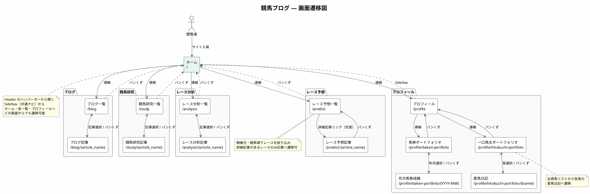

# 画面設計書（競馬ブログ）

上位文書: [アーキテクチャ設計書](./architecture_design.md)  
関連文書: [機能コンポーネント設計書](./component_design.md) / [UI設計（個別画面・UI_design/）](./UI_design/)

1. [1. はじめに](#1-はじめに)
   1. [1.1 目的](#11-目的)
   2. [1.2 対象読者](#12-対象読者)
2. [2. 画面一覧](#2-画面一覧)
   1. [2.1 画面遷移図](#21-画面遷移図)
3. [3. 画面詳細](#3-画面詳細)
   1. [3.1 ホーム](#31-ホーム)
   2. [3.2 ブログ一覧・記事](#32-ブログ一覧記事)
   3. [3.3 競馬研究一覧・記事](#33-競馬研究一覧記事)
   4. [3.4 レース分析一覧・記事](#34-レース分析一覧記事)
   5. [3.5 レース予想一覧・記事](#35-レース予想一覧記事)
   6. [3.6 プロフィール](#36-プロフィール)
      1. [3.6.1 一口馬主ポートフォリオ](#361-一口馬主ポートフォリオ)
         1. [3.6.1.1 愛馬日記](#3611-愛馬日記)
      2. [3.6.2 馬券ポートフォリオ](#362-馬券ポートフォリオ)
         1. [3.6.2.1 月次馬券成績](#3621-月次馬券成績)
4. [4. 変更履歴](#4-変更履歴)

## 1. はじめに

### 1.1 目的

本書は、競馬ブログシステムの画面構成・URL・概要を明確にし、  
UI実装および画面テストの基準とすることを目的とする。

レイアウト・ワイヤー・UI要素の詳細は [UI設計（個別画面）](./UI_design/) に委譲する。

### 1.2 対象読者

- 開発者
- テスター
- 保守担当者

## 2. 画面一覧

| 画面名 | URL | 概要 | UI設計 |
| ------ | --- | ---- | ------ |
| ホーム | `/` | トップ。新着スライド＋カテゴリタブ | [home.md](./UI_design/home/home.md) |
| ブログ一覧 | `/blog` | ブログ記事の新着カード一覧 | [list.md](./UI_design/blog/list.md) |
| ブログ記事 | `/blog/{article_name}` | ブログ記事詳細 | [article.md](./UI_design/blog/article.md) |
| 競馬研究一覧 | `/study` | 研究記事の新着カード一覧 | [list.md](./UI_design/study/list.md) |
| 競馬研究記事 | `/study/{article_name}` | 研究記事詳細 | [article.md](./UI_design/study/article.md) |
| レース分析一覧 | `/analysis` | 分析記事の新着カード一覧 | [list.md](./UI_design/analysis/list.md) |
| レース分析記事 | `/analysis/{article_name}` | 対象レースの分析記事 | [article.md](./UI_design/analysis/article.md) |
| レース予想一覧 | `/predict` | 開催日・競馬場単位のレース予想一覧 | [list.md](./UI_design/predict/list.md) |
| レース予想記事 | `/predict/{article_name}` | 予想記事詳細 | [article.md](./UI_design/predict/article.md) |
| プロフィール | `/profile` | 自己紹介 | [profile.md](./UI_design/profile/profile.md) |
| 一口馬主ポートフォリオ | `/profile/hitokuchi-portfolio` | 出資馬の保有状況一覧・可視化 | [hitokuchi-portfolio.md](./UI_design/profile/hitokuchi-portfolio.md) |
| 愛馬日記 | `/profile/hitokuchi-portfolio/{bamei}` | 出資馬ごとの日記・観戦記 | [aiba-diary.md](./UI_design/profile/aiba-diary.md) |
| 馬券ポートフォリオ | `/profile/baken-portfolio` | 馬券成績・購入傾向の可視化 | [baken-portfolio.md](./UI_design/profile/baken-portfolio.md) |
| 月次馬券成績 | `/profile/baken-portfolio/{YYYY-MM}` | 月次の馬券成績記事 | [baken-monthly.md](./UI_design/profile/baken-monthly.md) |

共通レイアウト：Header（ロゴ＋ハンバーガー）＋ SideNav（ドロワーナビ）＋ メインコンテンツ ＋ Footer  
詳細は [UI設計：共通レイアウト](./UI_design/common.md) を参照。

### 2.1 画面遷移図

## 3. 画面詳細

本書の画面詳細は **URL・概要・主な表示項目** の粒度とする。  
レイアウト・ワイヤーは各 UI 設計文書を参照。

### 3.1 ホーム

- URL：`/`
- 説明：サイトトップ。新着記事スライドショーと、カテゴリタブ付きの新着一覧を表示
- 主な表示項目：新着スライド、タブ（レース予想 / 競馬研究 / ブログ）、カテゴリ別新着（最大5件）
- UI設計：[home/home.md](./UI_design/home/home.md)

### 3.2 ブログ一覧・記事

**ブログ一覧**

- URL：`/blog`
- 説明：ブログカテゴリの記事を新着順でカード一覧表示（10件/ページ＋ページネーション）
- 主な表示項目：サムネイル、タイトル、公開日、タグ
- UI設計：[blog/list.md](./UI_design/blog/list.md)

**ブログ記事**

- URL：`/blog/{article_name}`
- 説明：Markdown から変換された記事を表示
- 主な表示項目：

| 項目 | 説明 |
| ---- | ---- |
| パンくずリスト | ホーム > ブログ > 記事タイトル |
| タイトル（h1） | 記事タイトル（1ページ1つのみ） |
| 公開日 | Front Matter の date |
| カテゴリ | 記事カテゴリ |
| タグ | 記事タグ（複数可） |
| 本文 | Markdown 変換 HTML |
| OGP画像 | 記事ごとに設定（未設定時はデフォルト） |
| 広告 | Google Ads（レイアウト固定領域） |

- UI設計：[blog/article.md](./UI_design/blog/article.md)

### 3.3 競馬研究一覧・記事

**競馬研究一覧**

- URL：`/study`
- 説明：研究カテゴリの記事を新着順でカード一覧表示（ブログ一覧と同型）
- UI設計：[study/list.md](./UI_design/study/list.md)

**競馬研究記事**

- URL：`/study/{article_name}`
- 説明・表示項目：ブログ記事と同様。パンくずの親を「競馬研究」とする
- UI設計：[study/article.md](./UI_design/study/article.md)

### 3.4 レース分析一覧・記事

**レース分析一覧**

- URL：`/analysis`
- 説明：レース分析カテゴリの記事を新着順でカード一覧表示（ブログ一覧と同型）
- UI設計：[analysis/list.md](./UI_design/analysis/list.md)

**レース分析記事**

- URL：`/analysis/{article_name}`
- 説明：対象レースの分析記事を表示。上部にレース名・レース情報、本文は Markdown
- UI設計：[analysis/article.md](./UI_design/analysis/article.md)

### 3.5 レース予想一覧・記事

**レース予想一覧**

- URL：`/predict`
- 説明：年・開催日・競馬場で対象を選び、当日のレース一覧を表示
- 主な表示項目：レース番号、クラス、レース名、コース、頭数、予想印（◎〇▲△★）、買い目。詳細記事がある場合はリンクで遷移
- UI設計：[predict/list.md](./UI_design/predict/list.md)

**レース予想記事**

- URL：`/predict/{article_name}`
- 説明・表示項目：ブログ記事と同様。パンくずの親を「レース予想」とする
- UI設計：[predict/article.md](./UI_design/predict/article.md)

### 3.6 プロフィール

- URL：`/profile`
- 説明：運営者の自己紹介を表示
- 主な表示項目：プロフィール本文、サイト概要
- UI設計：[profile/profile.md](./UI_design/profile/profile.md)

#### 3.6.1 一口馬主ポートフォリオ

- URL: `/profile/hitokuchi-portfolio`
- 内容: 一口馬主（クラブ馬）の保有状況を一覧・可視化。出資馬リスト、成績など全体のポートフォリオを表示する。
- 主な項目:
  - 出資馬リスト（馬名、所属クラブ、戦績、最新近況）
  - ポートフォリオサマリ（総出資馬数、現役／獲得賞金など）
- UI設計：[profile/hitokuchi-portfolio.md](./UI_design/profile/hitokuchi-portfolio.md)

##### 3.6.1.1 愛馬日記

- URL: `/profile/hitokuchi-portfolio/{bamei}`
- 説明: 一口馬主として出資している馬ごとの日記や観戦記、思い出を記録・表示する画面。紹介・日記・血統・分析タブを切り替え、レース成績表と日記ファイルを1ページに埋め込んで表示する。hitokuchi-portfolioのリンクから表示する。
- 主な表示項目:
  - 紹介（紹介表、レース成績）
  - 日記（観戦記、写真）
  - 血統（5代血統表）
  - 分析（出走成績の簡易集計）
- UI設計：[profile/aiba-diary.md](./UI_design/profile/aiba-diary.md)

#### 3.6.2 馬券ポートフォリオ

- URL: `/profile/baken-portfolio`
- 内容: 馬券成績（収支・的中率・回収率など）や購入傾向を集計し、グラフやダイジェストで可視化する。月次成績は `src/articles/baken/{YYYY-MM}/index.md` から集計する。
- 主な項目:
  - 年月別および全体の収支・成績グラフ（年月から月次記事へ）
  - 券種/カテゴリ別の詳細分析
  - 購入履歴まとめ
- UI設計：[profile/baken-portfolio.md](./UI_design/profile/baken-portfolio.md)

##### 3.6.2.1 月次馬券成績

- URL: `/profile/baken-portfolio/{YYYY-MM}`
- 説明: 月次の馬券成績記事。当月サマリ・券種・購入履歴と振り返り本文を表示する。馬券ポートフォリオの年月リンクから表示する。
- 主な表示項目:
  - 当月サマリ（収支・的中率・回収率）
  - 本文（Markdown）
  - 券種別・購入履歴（Front Matter）
- UI設計：[profile/baken-monthly.md](./UI_design/profile/baken-monthly.md)

## 4. 変更履歴

| 日付 | 版 | 内容 | 担当 |
| ---- | --- | ---- | ---- |
| 2026-02-02 | 1.0 | 初版作成（設計書 画面設計として） | βshort |
| 2026-05-23 | 1.1 | 仕様書に基づき更新 | βshort |
| 2026-05-23 | 1.3 | レース分析・レース予想の画面を追加 | βshort |
| 2026-08-10 | 2.0 | design.md から画面設計書として分割 | βshort |
| 2026-08-10 | 2.1 | 画面遷移図を PlantUML で追加 | βshort |
| 2026-08-10 | 2.2 | 画面詳細の詳細は UI_design/ へ委譲する旨を追記 | βshort |
| 2026-08-10 | 2.3 | 共通ナビを Header 横並びからハンバーガー＋SideNav に変更 | βshort |
| 2026-08-10 | 2.4 | UI_design に合わせて画面一覧・詳細を整理。page_design 参照を削除。予想一覧を開催日・場単位に更新 | βshort |
| 2026-08-13 | 2.5 | 一口馬主ポートフォリオ・愛馬日記・馬券ポートフォリオの UI 設計参照と画面一覧・遷移図を追加 | βshort |
| 2026-08-13 | 2.6 | 愛馬日記の UI 設計ファイル名を aiba-diary.md に変更 | βshort |
| 2026-08-17 | 2.7 | 月次馬券成績画面を追加。成績を article で月次管理 | βshort |
