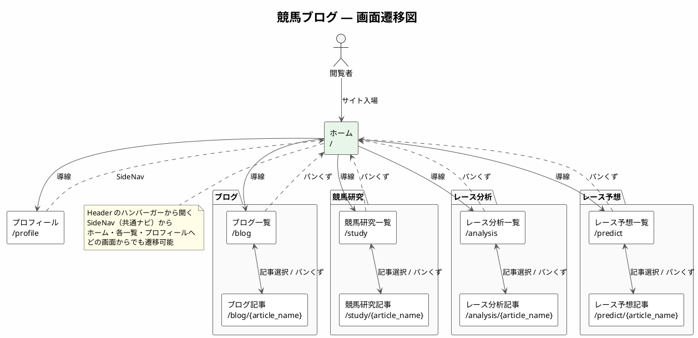

# 画面設計書（競馬ブログ）

上位文書: [アーキテクチャ設計書](./architecture_design.md)  
関連文書: [機能コンポーネント設計書](./component_design.md) / [UI設計（個別画面・UI_design/）](./UI_design/) / [画面ワイヤー（page_design/）](./page_design/)

1. [1. はじめに](#1-はじめに)
   1. [1.1 目的](#11-目的)
   2. [1.2 対象読者](#12-対象読者)
2. [2. 画面一覧](#2-画面一覧)
   1. [2.1 画面遷移図](#21-画面遷移図)
3. [3. 画面詳細](#3-画面詳細)
   1. [3.1 ホーム](#31-ホーム)
   2. [3.2 ブログ一覧・記事](#32-ブログ一覧記事)
   3. [3.3 競馬研究一覧・記事](#33-競馬研究一覧記事)
   4. [3.4 レース分析一覧・記事](#34-レース分析一覧記事)
   5. [3.5 レース予想一覧・記事](#35-レース予想一覧記事)
   6. [3.6 プロフィール](#36-プロフィール)
4. [4. 変更履歴](#4-変更履歴)

## 1. はじめに

### 1.1 目的

本書は、競馬ブログシステムの画面構成・URL・表示項目を明確にし、  
UI実装および画面テストの基準とすることを目的とする。

### 1.2 対象読者

- 開発者
- テスター
- 保守担当者

## 2. 画面一覧

| 画面名       | 概要                     |
| ------------ | ------------------------ |
| ホーム       | トップページ             |
| ブログ一覧   | ブログ記事一覧（新着順） |
| ブログ記事   | ブログ記事詳細           |
| 競馬研究一覧 | 研究記事一覧（新着順）   |
| 競馬研究記事 | 研究記事詳細             |
| レース分析一覧 | レース分析記事一覧（新着順） |
| レース分析記事 | レース分析記事詳細   |
| レース予想一覧 | レース予想記事一覧（新着順） |
| レース予想記事 | レース予想記事詳細   |
| プロフィール | 自己紹介                 |

共通レイアウト：Header（ロゴ＋ハンバーガー）＋ SideNav（ドロワーナビ）＋ メインコンテンツ ＋ Footer  
詳細は [UI設計：共通レイアウト](./UI_design/common.md) を参照。

### 2.1 画面遷移図

## 3. 画面詳細

レイアウト・UI要素・状態・レスポンシブ等の詳細は [UI設計（個別画面）](./UI_design/) を参照。

### 3.1 ホーム

- URL：/
- 説明：サイトトップ。各セクションへの導線を表示
- 表示項目：サイトタイトル、ブログ・研究・レース分析・レース予想へのリンク、プロフィールへのリンク

### 3.2 ブログ一覧・記事

**ブログ一覧**

- URL：/blog
- 説明：ブログカテゴリの記事を新着順で一覧表示
- 表示項目：サムネイル、タイトル、公開日、カテゴリ、タグ（任意）

**ブログ記事**

- URL：/blog/{article_name}
- 説明：Markdownから変換された記事を表示
- 表示項目：

| 項目           | 説明                         |
| -------------- | ---------------------------- |
| パンくずリスト | ホーム > ブログ > 記事タイトル |
| タイトル（h1） | 記事タイトル（1ページ1つのみ） |
| 公開日         | Front Matterの date          |
| カテゴリ       | 記事カテゴリ                 |
| タグ           | 記事タグ（複数可）           |
| 本文           | Markdown変換HTML             |
| OGP画像        | 記事ごとに設定（未設定時はデフォルト） |
| 広告           | Google Ads（レイアウト固定領域） |

### 3.3 競馬研究一覧・記事

**競馬研究一覧**

- URL：/study
- 説明：研究カテゴリの記事を新着順で一覧表示
- 表示項目：ブログ一覧と同様

**競馬研究記事**

- URL：/study/{article_name}
- 説明・表示項目：ブログ記事と同様。パンくずの親を「競馬研究」とする

### 3.4 レース分析一覧・記事

**レース分析一覧**

- URL：/analysis
- 説明：レース分析カテゴリの記事を新着順で一覧表示
- 表示項目：ブログ一覧と同様

**レース分析記事**

- URL：/analysis/{article_name}
- 説明・表示項目：ブログ記事と同様。パンくずの親を「レース分析」とする

### 3.5 レース予想一覧・記事

**レース予想一覧**

- URL：/predict
- 説明：レース予想カテゴリの記事を新着順で一覧表示
- 表示項目：ブログ一覧と同様

**レース予想記事**

- URL：/predict/{article_name}
- 説明・表示項目：ブログ記事と同様。パンくずの親を「レース予想」とする

### 3.6 プロフィール

- URL：/profile
- 説明：運営者の自己紹介を表示
- 表示項目：プロフィール本文、サイト概要

## 4. 変更履歴

| 日付       | 版  | 内容                                       | 担当   |
| ---------- | --- | ------------------------------------------ | ------ |
| 2026-02-02 | 1.0 | 初版作成（設計書 画面設計として）          | βshort |
| 2026-05-23 | 1.1 | 仕様書に基づき更新                         | βshort |
| 2026-05-23 | 1.3 | レース分析・レース予想の画面を追加         | βshort |
| 2026-08-10 | 2.0 | design.md から画面設計書として分割         | βshort |
| 2026-08-10 | 2.1 | 画面遷移図を PlantUML で追加               | βshort |
| 2026-08-10 | 2.2 | 画面詳細の詳細は UI_design/ へ委譲する旨を追記 | βshort |
| 2026-08-10 | 2.3 | 共通ナビを Header 横並びからハンバーガー＋SideNav に変更 | βshort |
