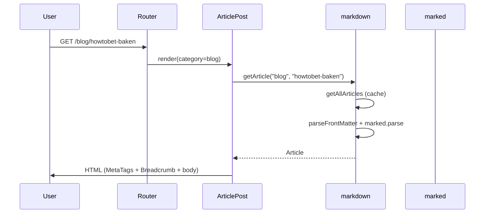

# 詳細設計書（競馬ブログ）

上位文書: [基本設計書（索引）](../03_design/design.md) / [アーキテクチャ設計書](../03_design/architecture_design.md) / [画面設計書](../03_design/screen_design.md) / [機能コンポーネント設計書](../03_design/component_design.md)  
実装対象: `keiba-blog/`

1. [1. はじめに](#1-はじめに)
2. [2. 実装概要](#2-実装概要)
3. [3. ディレクトリ構成](#3-ディレクトリ構成)
4. [4. 起動・ルーティング](#4-起動ルーティング)
5. [5. ユーティリティ設計](#5-ユーティリティ設計)
6. [6. コンポーネント詳細](#6-コンポーネント詳細)
7. [7. 画面実装詳細](#7-画面実装詳細)
8. [8. 記事データ・処理フロー](#8-記事データ処理フロー)
9. [9. スタイル設計](#9-スタイル設計)
10. [10. 依存パッケージ](#10-依存パッケージ)
11. [11. 開発・ビルド環境](#11-開発ビルド環境)
12. [12. 基本設計との差分](#12-基本設計との差分)
13. [13. 既知の制約・今後の拡張](#13-既知の制約今後の拡張)
14. [14. 変更履歴](#14-変更履歴)

<div style="page-break-after: always;"></div>

## 1. はじめに

### 1.1 目的

本書は、基本設計書（`doc/03_design/` 配下のアーキテクチャ／画面／機能コンポーネント設計書）に基づき **実際に実装した内容** をモジュール単位で記述する。  
実装の追跡、改修、テスト作成時に、ソースコードと設計の対応を確認するために用いる。

### 1.2 対象読者

- 実装担当者
- レビュアー
- 保守担当者

### 1.3 関連ドキュメント

| 文書 | パス |
| ---- | ---- |
| 要求仕様書 | `doc/01_requirement/requirement.md` |
| 要件定義書 | `doc/02_specification/specification.md` |
| 基本設計書（索引） | `doc/03_design/design.md` |
| アーキテクチャ設計書 | `doc/03_design/architecture_design.md` |
| 画面設計書 | `doc/03_design/screen_design.md` |
| 機能コンポーネント設計書 | `doc/03_design/component_design.md` |
| 開発環境構築 | `doc/03_design/buildDevEnv.md` |

<div style="page-break-after: always;"></div>

## 2. 実装概要

### 2.1 アプリケーション構成

SPA（Single Page Application）として、クライアント側でルーティングと記事描画を行う。

```
main.tsx
  └─ HelmetProvider
       └─ App.tsx
            └─ BrowserRouter          ← Header / Footer を含む全体をラップ
                 ├─ Header
                 ├─ main > Routes    ← 画面コンポーネント
                 └─ Footer
```

### 2.2 技術スタック（実装版）

| 区分 | 採用技術 | バージョン（目安） |
| ---- | -------- | ------------------ |
| フロントエンド | React | 19.x |
| ビルド | Vite | 7.x |
| 言語 | TypeScript | 5.8.x |
| UI | Tailwind CSS | 4.x（`@tailwindcss/vite`） |
| ルーティング | react-router-dom | 7.x |
| Markdown変換 | marked | 15.x |
| Front Matter | js-yaml（自前ラッパー） | 4.x |
| メタ情報 | react-helmet-async | 3.x |

### 2.3 記事読込のタイミング

| 処理 | タイミング |
| ---- | ---------- |
| Markdown ファイル収集 | Vite ビルド時（`import.meta.glob`・eager） |
| Front Matter 解析 | 初回 `getAllArticles()` 呼び出し時（メモリキャッシュ） |
| Markdown → HTML | 同上（`marked.parse`・同期） |
| 画面描画 | ブラウザ実行時（React） |

<div style="page-break-after: always;"></div>

## 3. ディレクトリ構成

### 3.1 リポジトリ全体

```txt
KEIBA_BLOG/
├─ docker/                  # Node 開発用 Dockerfile
├─ docker-compose.yml
├─ doc/
│  ├─ 01_requirement/
│  ├─ 02_specification/
│  ├─ 03_design/
│  └─ 04_detailed_design/   # 本書
├─ keiba-blog/              # フロントエンド本体
└─ .cursor/rules/           # Agent 向け Docker 実行ルール
```

### 3.2 keiba-blog ソース構成

```txt
keiba-blog/
├─ public/
│  └─ robots.txt
├─ src/
│  ├─ articles/             # 記事 Markdown（カテゴリ別）
│  │  ├─ blog/{slug}/index.md
│  │  ├─ study/{slug}/index.md
│  │  ├─ analysis/{slug}/index.md
│  │  ├─ predict/{slug}/index.md
│  │  ├─ hitokuchi/{bamei}/index.md  # 出資馬データ + 紹介（表）
│  │  ├─ hitokuchi/{bamei}/{YYYY-MM-DD}-{slug}.md  # 日記（埋め込み）
│  │  ├─ baken/{YYYY-MM}/index.md    # 月次馬券成績
│  │  └─ template/index.md  # 雛形（一覧非表示）
│  ├─ pages/                # 画面コンポーネント（設計書の画面一覧）
│  ├─ component/            # 共通・部品コンポーネント
│  ├─ utils/                # 記事・サイト定数
│  ├─ App.tsx
│  ├─ main.tsx
│  └─ index.css
├─ dist/                    # ビルド成果物
├─ vite.config.ts
└─ package.json
```

### 3.3 記事配置規則

| 項目 | 規則 |
| ---- | ---- |
| パス | `src/articles/{category}/{slug}/index.md` |
| category | `blog` \| `study` \| `analysis` \| `predict` |
| slug | kebab-case（例: `howtobet-baken`） |
| URL | `/{category}/{slug}`（例: `/blog/howtobet-baken`） |

愛馬日記は4カテゴリとは別系統とする。

| 項目 | 規則 |
| ---- | ---- |
| パス | `src/articles/hitokuchi/{bamei}/index.md`（馬データ）と `{YYYY-MM-DD}-{slug}.md`（日記） |
| bamei | URL パラメータ（英名 kebab-case のフォルダ名。例: `flashing-ruby`） |
| URL | `/profile/hitokuchi-portfolio/{bamei}`（日記ファイルは個別 URL にしない） |
| 読込 | `src/data/hitokuchiHorses.ts`（`template` 除外）。ブログ等の一覧には出さない |

馬券成績も4カテゴリとは別系統とする。

| 項目 | 規則 |
| ---- | ---- |
| パス | `src/articles/baken/{YYYY-MM}/index.md` |
| yearMonth | `YYYY-MM`（フォルダ名。例: `2025-08`） |
| URL | `/profile/baken-portfolio/{YYYY-MM}` |
| 読込 | `src/data/bakenPortfolio.ts`（`template` 除外）。ブログ等の一覧には出さない |

<div style="page-break-after: always;"></div>

## 4. 起動・ルーティング

### 4.1 エントリポイント（main.tsx）

| 処理 | 内容 |
| ---- | ---- |
| スタイル読込 | `./index.css`（Tailwind） |
| メタ制御 | `HelmetProvider` でラップ |
| マウント | `#root` に `App` を `StrictMode` で描画 |

### 4.2 ルーティング定義（App.tsx）

`BrowserRouter` は **Header・Footer を含むアプリ全体** をラップする。  
（`Link` / `NavLink` は Router コンテキスト内である必要がある。）

| path | コンポーネント | ファイル |
| ---- | -------------- | -------- |
| `/` | Home | `pages/Home.tsx` |
| `/blog` | BlogList | `pages/BlogList.tsx` |
| `/blog/:article_name` | BlogPost | `pages/BlogPost.tsx` |
| `/study` | StudyList | `pages/StudyList.tsx` |
| `/study/:article_name` | StudyPost | `pages/StudyPost.tsx` |
| `/analysis` | AnalysisList | `pages/AnalysisList.tsx` |
| `/analysis/:article_name` | AnalysisPost | `pages/AnalysisPost.tsx` |
| `/predict` | PredictList | `pages/PredictList.tsx` |
| `/predict/:article_name` | PredictPost | `pages/PredictPost.tsx` |
| `/profile` | Profile | `pages/Profile.tsx` |
| `/profile/hitokuchi-portfolio` | HitokuchiPortfolio | `pages/HitokuchiPortfolio.tsx` |
| `/profile/hitokuchi-portfolio/:bamei` | AibaDiary | `pages/AibaDiary.tsx` |
| `/profile/baken-portfolio` | BakenPortfolio | `pages/BakenPortfolio.tsx` |
| `/profile/baken-portfolio/:yearMonth` | BakenMonthlyPost | `pages/BakenMonthlyPost.tsx` |
| `*` | NotFound | `pages/NotFound.tsx` |

### 4.3 カテゴリ別コンポーネントの委譲

一覧・詳細は共通実装に `category` を渡す薄いラッパーとする。

```
BlogList  → ArticleList(category="blog")
BlogPost  → ArticlePost(category="blog")
StudyList → ArticleList(category="study")
…（analysis / predict も同様）
```

<div style="page-break-after: always;"></div>

## 5. ユーティリティ設計

### 5.1 site.ts

サイト共通定数とカテゴリ設定。

| エクスポート | 型 | 説明 |
| ------------ | -- | ---- |
| `SITE_NAME` | `string` | サイト名（`"競馬ブログ"`） |
| `SITE_DESCRIPTION` | `string` | デフォルト説明文 |
| `DEFAULT_OG_IMAGE` | `string` | OGP デフォルト画像パス |
| `ArticleCategory` | union | `"blog" \| "study" \| "analysis" \| "predict"` |
| `CATEGORY_CONFIG` | `Record` | 各カテゴリの表示名・一覧 path |

### 5.2 frontMatter.ts

ブラウザ向け Front Matter 解析。

| 関数 | 入力 | 出力 |
| ---- | ---- | ---- |
| `parseFrontMatter(raw)` | Markdown 全文 | `{ data, content }` |

**処理手順**

1. 正規表現 `^---\n...\n---\n` で YAML ブロックと本文を分割
2. `js-yaml` の `yaml.load` で `data` をオブジェクト化
3. マッチしない・YAML 不正時は `data: {}`、全文を `content` とする

**採用理由:** 基本設計の `gray-matter` は Node.js の `Buffer` に依存し、ブラウザ実行時に `ReferenceError: Buffer is not defined` となるため不採用。

### 5.3 markdown.ts

記事の読込・変換・検索 API。

#### 型定義

```typescript
interface ArticleFrontMatter {
  title: string;
  date: string;
  description?: string;
  category: ArticleCategory;
  tags?: string[];
  thumbnail?: string;
  ogImage?: string;
  noindex?: boolean;
}

interface Article {
  slug: string;
  category: ArticleCategory;
  frontMatter: ArticleFrontMatter;
  contentHtml: string;
}
```

#### 公開関数

| 関数 | 説明 |
| ---- | ---- |
| `getAllArticles()` | 全記事取得（`template` スラッグ除外・キャッシュ） |
| `getArticlesByCategory(category)` | カテゴリ絞込＋`date` 降順ソート |
| `getArticle(category, slug)` | 単一記事取得。未存在時 `undefined` |
| `formatDate(dateStr)` | `ja-JP` ロケールの日付表示 |

#### 記事パース（内部）

| ステップ | 処理 |
| -------- | ---- |
| 1 | `import.meta.glob` で `blog` / `study` / `analysis` / `predict` 配下の `index.md` を読込 |
| 2 | パスから `category`・`slug` を正規表現抽出 |
| 3 | `parseFrontMatter` でメタ情報と本文分離 |
| 4 | `normalizeFrontMatter` で必須項目補完 |
| 5 | `marked.parse(content, { async: false })` で HTML 化 |

#### normalizeFrontMatter のフォールバック

| 項目 | 欠落時の補完 |
| ---- | ------------ |
| title | 本文先頭 `# 見出し` → なければ slug |
| date | `"1970-01-01"` |
| category | フォルダパス上の category |

<div style="page-break-after: always;"></div>

## 6. コンポーネント詳細

### 6.1 コンポーネント一覧

| コンポーネント | ファイル | 責務 |
| -------------- | -------- | ---- |
| Header | `component/Header.tsx` | グローバルナビ（NavLink） |
| Footer | `component/Footer.tsx` | コピーライト |
| MetaTags | `component/MetaTags.tsx` | title / description / OGP / Twitter Card |
| GoogleAnalytics | `component/GoogleAnalytics.tsx` | GA4。マウント後に gtag を読み SPA の page_view を送信 |
| Breadcrumb | `component/Breadcrumb.tsx` | パンくずリスト |
| BlogCard | `component/BlogCard.tsx` | 一覧カード |
| AdUnit | `component/AdUnit.tsx` | 広告プレースホルダ（CLS 抑制） |
| ArticleList | `component/ArticleList.tsx` | カテゴリ別一覧（共通） |
| ArticlePost | `component/ArticlePost.tsx` | 記事詳細（共通） |
| Home | `pages/Home.tsx` | トップ |
| BlogList〜PredictList | `pages/*List.tsx` | ArticleList への委譲 |
| BlogPost〜PredictPost | `pages/*Post.tsx` | ArticlePost への委譲 |
| Profile | `pages/Profile.tsx` | プロフィール |
| NotFound | `pages/NotFound.tsx` | 404 |
| ArticleList | `component/ArticleList.tsx` | 一覧共通実装 |
| ArticlePost | `component/ArticlePost.tsx` | 詳細共通実装 |

### 6.2 MetaTags

| props | 型 | デフォルト | 説明 |
| ----- | -- | ---------- | ---- |
| title | string | — | ページタイトル |
| description | string | `SITE_DESCRIPTION` | meta description |
| ogType | `"website"` \| `"article"` | `"website"` | og:type |
| ogImage | string | `DEFAULT_OG_IMAGE` | og:image（相対 path は origin 付与） |
| path | string | — | og:url 用（`origin + path`） |
| noindex | boolean | false | true 時 `robots noindex` |

**タイトル規則:** `title === SITE_NAME` のとき `"競馬ブログ"`、それ以外は `"{title} | 競馬ブログ"`。

### 6.3 BlogCard

| 表示項目 | データソース |
| -------- | ------------ |
| サムネイル | `frontMatter.thumbnail`（未設定時プレースホルダ） |
| タイトル | `frontMatter.title` |
| 公開日 | `formatDate(frontMatter.date)` |
| カテゴリ名 | `CATEGORY_CONFIG[category].label` |
| タグ | `frontMatter.tags` |
| リンク先 | `{categoryPath}/{slug}` |

### 6.4 ArticlePost

| 処理 | 条件 | 結果 |
| ---- | ---- | ---- |
| 記事取得 | `useParams().article_name` | `getArticle(category, slug)` |
| 404 | パラメータなし / 記事なし | `<NotFound />` |
| 本文描画 | 取得成功 | `dangerouslySetInnerHTML` で `contentHtml` |
| h1 | ヘッダー | Front Matter の `title`（本文内 h1 は使わない設計） |

### 6.5 AdUnit

| 項目 | 実装 |
| ---- | ---- |
| 現状 | 枠線付きプレースホルダ（「広告枠」表示） |
| CLS 対策 | `min-h-[250px]` |
| 拡張 | Google Ads スクリプト埋め込み予定 |

### 6.6 GoogleAnalytics

| 項目 | 実装 |
| ---- | ---- |
| 配置 | `App.tsx`（Router 内側、`AppShell` の兄弟） |
| 発火 | `useEffect`（プリレンダーでは送らない） |
| イベント | location 変化ごとに `page_view` |
| 測定ID | `VITE_GA_MEASUREMENT_ID`。空なら無効 |

<div style="page-break-after: always;"></div>

## 7. 画面実装詳細

### 7.1 ホーム（Home）

- **URL:** `/`
- **MetaTags:** `ogType=website`, `path="/"`
- **UI:** サイト名・説明、4 カテゴリ＋プロフィールへのカードリンク（2 列グリッド）

### 7.2 記事一覧（ArticleList）

- **URL:** `/blog`, `/study`, `/analysis`, `/predict`
- **データ:** `getArticlesByCategory(category)`
- **空状態:** 「記事はまだありません。」
- **広告:** 一覧上下に `AdUnit` 各 1 つ

### 7.3 記事詳細（ArticlePost）

- **URL:** `/{category}/{article_name}`
- **パンくず:** ホーム > カテゴリ名 > 記事タイトル
- **MetaTags:** `ogType=article`, 記事ごとの title / description / ogImage

### 7.4 プロフィール（Profile）

- **URL:** `/profile`
- **内容:** 運営者紹介（アイコン・表示名・肩書き・SNS・スタンス・好み・免責）・サイト概要（静的テキスト）

### 7.5 404（NotFound）

- **URL:** 未定義 path、存在しない記事 slug
- **UI:** メッセージとホームへのリンク

<div style="page-break-after: always;"></div>

## 8. 記事データ・処理フロー

### 8.1 Front Matter 定義（実装）

```yaml
---
title: "記事タイトル"           # 必須（欠落時はフォールバック）
date: "2025-07-16"              # 必須（欠落時 1970-01-01）
description: "記事の要約"       # 任意
category: "blog"                # 必須（blog | study | analysis | predict）
tags: ["競馬", "予想"]          # 任意
thumbnail: "/images/.../thumb.jpg"  # 任意
ogImage: "/images/.../og.jpg"       # 任意
noindex: false                  # 任意（MetaTags に反映）
---
```

### 8.2 登録済み記事一覧（2026-05-24 時点）

| カテゴリ | slug | タイトル（Front Matter） |
| -------- | ---- | ------------------------ |
| blog | howtobet-baken | 馬券の買い方 |
| blog | howtobet-betting | 馬券の賭け型 |
| blog | howtoselect-betrace | 賭けるレースの選び方 |
| blog | keiba-pedia | 競馬用語 |
| blog | predictsign | 予想印 |
| blog | anauma-ryugi | 穴馬の流儀 |
| blog | betaryu-keiba | べた流　馬券の型 |
| study | keiba-predict | 競馬予想の因子 |
| — | template | （一覧非表示・雛形のみ） |

`analysis` / `predict` カテゴリはルート・コンポーネントのみ実装済みで、記事ファイルは未配置。

### 8.3 記事表示シーケンス



<div style="page-break-after: always;"></div>

## 9. スタイル設計

### 9.1 Tailwind CSS

- `index.css` で `@import "tailwindcss"`
- Vite プラグイン `@tailwindcss/vite` を使用（Tailwind v4）

### 9.2 記事本文（.article-body）

`index.css` で Markdown 出力 HTML 向けスタイルを定義。

| 要素 | スタイル概要 |
| ---- | ------------ |
| h2 / h3 | 余白・フォントサイズ・太字 |
| p | 行間 |
| ul / ol | リストマーカー・インデント |
| table | 枠線・セル padding |
| a | 青色・下線 |
| code / pre | 背景・等幅 |

### 9.3 レイアウト

| 要素 | クラス |
| ---- | ------ |
| アプリ全体 | `flex min-h-screen flex-col` |
| メイン | `flex-1` |
| 一覧最大幅 | `max-w-4xl` |
| 記事最大幅 | `max-w-3xl` |

<div style="page-break-after: always;"></div>

## 10. 依存パッケージ

### 10.1 dependencies

| パッケージ | 用途 |
| ---------- | ---- |
| react / react-dom | UI |
| react-router-dom | ルーティング |
| react-helmet-async | head メタタグ |
| marked | Markdown → HTML |
| js-yaml | Front Matter 解析 |
| tailwindcss / @tailwindcss/vite | スタイル |

### 10.2 devDependencies

| パッケージ | 用途 |
| ---------- | ---- |
| typescript / @types/* | 型チェック |
| vite / @vitejs/plugin-react | ビルド・HMR |
| eslint 系 | 静的解析 |

<div style="page-break-after: always;"></div>

## 11. 開発・ビルド環境

### 11.1 Docker Compose

| 項目 | 値 |
| ---- | -- |
| サービス名 | `node` |
| イメージ | `docker/Dockerfile`（node:22-alpine） |
| マウント | リポジトリルート → `/projects` |
| ポート | `5173:5173` |

### 11.2 コマンド（コンテナ内）

```bash
docker compose up -d
docker compose exec node sh -c "cd keiba-blog && npm install"
docker compose exec node sh -c "cd keiba-blog && npm run dev"
docker compose exec node sh -c "cd keiba-blog && npm run build"
```

### 11.3 Vite 設定（vite.config.ts）

| 設定 | 値 | 目的 |
| ---- | -- | ---- |
| server.host | `true` | Docker 外からアクセス |
| server.port | `5173` | 開発サーバーポート |
| server.watch.usePolling | `true` | Windows + Docker ボリューム向け |

### 11.4 ビルド成果物

- 出力先: `keiba-blog/dist/`
- エントリ: `dist/index.html` + `dist/assets/*`
- SPA 用 `.htaccess` は基本設計書 §11.3 を参照（Xserver デプロイ時）

<div style="page-break-after: always;"></div>

## 12. 基本設計との差分

| 項目 | 基本設計 | 実装 |
| ---- | -------- | ---- |
| Front Matter 解析 | gray-matter | js-yaml + `frontMatter.ts`（ブラウザ対応） |
| BrowserRouter 位置 | 記載のみ | Header/Footer を含め全体をラップ |
| 旧記事パス | `src/article/*.md` | 廃止 → `src/articles/{category}/{slug}/index.md` |
| analysis / predict 記事 | 設計上あり | コンポーネントのみ・記事未配置 |
| Google Ads | AdUnit 埋め込み | プレースホルダのみ |
| OGP デフォルト画像 | `/images/og-default.jpg` | パス定義済み・ファイルは要配置 |
| sitemap.xml | public 配置 | 未実装（手動または将来スクリプト） |

<div style="page-break-after: always;"></div>

## 13. 既知の制約・今後の拡張

### 13.1 制約

| 項目 | 内容 |
| ---- | ---- |
| 記事追加 | ビルド（または dev サーバー再起動）で glob 再評価 |
| 本文 HTML | `dangerouslySetInnerHTML`（管理者作成 Markdown のみ） |
| SEO（noindex） | Front Matter 対応済み、sitemap 自動生成は未実装 |
| タグ一覧 | 表示のみ。タグ別フィルタは未実装 |

### 13.2 拡張候補

- `public/images/og-default.jpg` の配置
- Google Ads スクリプトを `AdUnit` に統合
- `analysis` / `predict` 記事の追加
- ビルド時 sitemap.xml 生成
- タグ別一覧ページ
- 基本設計書の gray-matter 記述を js-yaml に更新

<div style="page-break-after: always;"></div>

## 14. 変更履歴

| 日付 | 版 | 内容 | 担当 |
| ---- | -- | ---- | ---- |
| 2026-05-24 | 1.0 | 実装内容に基づき初版作成 | βshort |
| 2026-08-17 | 1.1 | 出資馬・愛馬日記を `src/articles/hitokuchi/{bamei}/index.md` で管理 | βshort |
| 2026-08-17 | 1.2 | 馬券成績を `src/articles/baken/{YYYY-MM}/index.md` で月次管理 | βshort |
| 2026-08-17 | 1.3 | 愛馬日記を `{YYYY-MM-DD}-{slug}.md` で個別管理し、レース成績表を埋め込み | βshort |
| 2026-08-18 | 1.4 | Google Analytics 4（`GoogleAnalytics`）を追加 | βshort |
| 2026-08-22 | 1.5 | 愛馬日記の `{bamei}` を英名 kebab-case（例: `flashing-ruby`）に変更 | βshort |
| 2026-08-23 | 1.6 | プロフィールに作者アイコン・表示名・SNSを追加 | βshort |
| 2026-08-23 | 1.7 | プロフィールに肩書き・スタンス・好み・免責を追加 | βshort |
