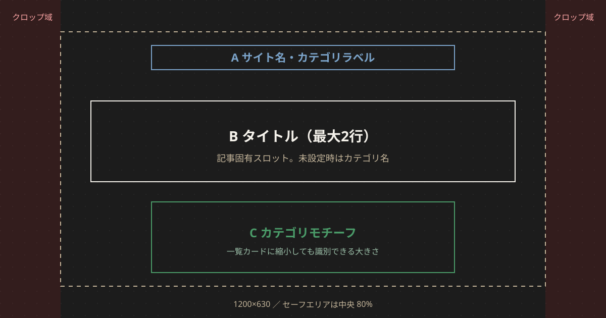

# サムネイル共通仕様

上位文書: [カタログ索引](./README.md)

記事カテゴリ横断のサイズ・レイアウト・タイポ・禁止事項。カテゴリ固有の色とモチーフは各仕様に委譲する。

## 1. 用途とサイズ

サイト上のサムネは次の3箇所で使われる。マスターは **1200×630** の1枚とし、CSS の `object-cover` で切り出す。

| 用途 | 表示 | 比率の目安 | Front Matter / 実装 |
| ---- | ---- | ---------- | ------------------- |
| OGP / Xカード | SNS シェア | 1.91:1（1200×630） | `ogImage`。未設定時は `DEFAULT_OG_IMAGE` |
| ホームスライド | `h-48` / `sm:h-64` 全幅 | 横長 | `thumbnail` |
| 一覧カード | `h-20 w-28` / `sm:h-24 sm:w-36` | 約 1.4:1〜1.5:1 | `thumbnail`。未設定時は「No Image」 |

`twitter:card` は `summary_large_image`（`MetaTags`）。OGP 用に 1200×630 以外を作る必要はない。

**推奨運用:** 記事ごとにマスター1枚を置き、`thumbnail` と `ogImage` に同じパスを書く。

```yaml
thumbnail: "/images/og/blog/howtobet-baken.png"
ogImage: "/images/og/blog/howtobet-baken.png"
```

## 2. レイアウトグリッド



キャンバスは 1200×630。SNS と一覧の `object-cover` は左右を切る。重要要素は中央 80% に置く。

| スロット | 位置 | 内容 |
| -------- | ---- | ---- |
| A ラベル | 上中央 | `競馬βLab　・　{カテゴリ名}`。小さく、トラッキング広め |
| B タイトル | 中央 | 記事タイトル。最大2行。未設定（カテゴリ既定）ではカテゴリ名 |
| C モチーフ | 下中央 | カテゴリを識別するシルエット。一覧サイズでも形が残る大きさ |

上端 8px にカテゴリのアクセントバーを置く（全幅なのでクロップ後も残る）。

左右 10% はクロップ危険域。ここにだけ意味のある文字・数字を置かない。

## 3. タイポグラフィ

| 要素 | 指定 |
| ---- | ---- |
| フォント | Noto Sans JP / 游ゴシック / Meiryo。明朝は使わない |
| ラベル (A) | 22px、weight 700、letter-spacing 広め、アクセント色 |
| タイトル (B) | 52–64px、weight 900、オフホワイト。2行を超えたら字を落とす（最小 40px） |
| サブ (任意) | 22–28px、アクセント色。カテゴリ語（「予想」「分析」）や性別 |
| 行長 | タイトルは全角 11 字目安。超える馬名は 2 行 |

タイトルを画像に入れる理由は、SNS プレビューで画像だけが先に目に入るため。一覧カードでは読めなくてよい（カード側にタイトルがある）。

## 4. 共通カラー（キャンバス）

本文 UI は白地だが、サムネはタイムラインで埋もれないよう一段暗い。カテゴリ差は背景の色相でつける。

| トークン | 値 | 使い方 |
| -------- | -- | ------ |
| `--thumb-fg` | `#f4f1ea` | タイトル |
| `--thumb-muted` | `#c4b59a` | ラベルのデフォルト（カテゴリ色で上書き可） |
| `--sex-male` | `#2563eb` | 牡馬（既存 `text-blue-600` に合わせる） |
| `--sex-female` | `#dc2626` | 牝馬（既存 `text-red-600`） |
| `--sex-gelding` | `#6b7280` | セン馬 |

カテゴリ色は各仕様の「カラー」を使う。

## 5. カテゴリ既定と記事個別

2段階ある。

| 種類 | タイトルスロット | 使う画面 |
| ---- | ---------------- | -------- |
| カテゴリ既定 | カテゴリ名（「ブログ」など） | 一覧ページ OGP、記事で画像未設定のとき |
| 記事個別 | 記事タイトル（馬名、レース名、年月） | 記事詳細 OGP、一覧カード、ホームスライド |

モチーフ・背景色は同じ。差し替えるのは B の文字と、一口馬主の性別アクセントだけ。

フォールバック順:

1. 記事の `ogImage` / `thumbnail`
2. カテゴリ既定（`/images/og/{category}/default.png`）
3. サイト既定 `DEFAULT_OG_IMAGE`（`/images/og-default.png`）

2 を実装するまでは 3 に落ちる。本カタログは 1 と 2 の見た目を定義する。

## 6. モチーフの原則

- 単色の幾何・シルエット。写真・グラデーションの強いテクスチャは使わない
- クラブロゴ・JRA ロゴ・実在馬の顔写真は置かない
- 数字（回収率・オッズ・頭数）を画像に焼き込まない。記事が更新されると嘘になる
- 一口馬主以外で青/赤の性別色を使わない（分析・予想と衝突する）

## 7. 書き出し

| 項目 | 指定 |
| ---- | ---- |
| マスター | 1200×630 |
| 形式 | PNG |
| 目安容量 | 120KB 前後（200KB 超えない） |
| 色空間 | sRGB |
| 素材 | モチーフは [assets](./assets/) に置く。本番はテンプレートへ配置してから書き出す |

## 8. やってはいけないこと

- マトリクスや記事画面のスクリーンショットをサムネにする（文字が潰れる）
- カテゴリをまたいで同じ背景色にする
- 左端・右端だけにサイト名や日付を置く
- 馬券サムネに馬のシルエットを置く（一口馬主と区別がつかない）
- 予想サムネにコース俯瞰を置く（分析と区別がつかない）

## 9. 変更履歴

| 日付 | 版 | 内容 | 担当 |
| ---- | -- | ---- | ---- |
| 2026-08-23 | 1.1 | モック SVG の記述を素材置き場へ変更 | βshort |
| 2026-08-23 | 1.0 | 初版 | βshort |
