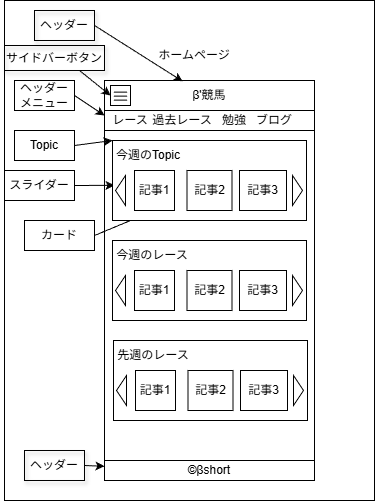

# 競馬ブログ
1. [アーキテクチャ](#アーキテクチャ)
   1. [使用技術](#使用技術)
   2. [React](#react)
   3. [レンダリング方式](#レンダリング方式)
   4. [公開方法](#公開方法)
2. [ページ一覧](#ページ一覧)
3. [ページUI](#ページui)
   1. [ホームページ](#ホームページ)
   2. [競馬ブログ](#競馬ブログ-1)
   3. [競馬研究](#競馬研究)
   4. [自己紹介](#自己紹介)
4. [設計](#設計)
   1. [ルーティング](#ルーティング)
      1. [参考コード](#参考コード)
5. [共通コンポーネント](#共通コンポーネント)
   1. [カード](#カード)
   2. [スライドショー](#スライドショー)
6. [スマホ対応](#スマホ対応)
7. [記事の構成](#記事の構成)
   1. [Markdown記事の構成](#markdown記事の構成)
   2. [フォルダ構成](#フォルダ構成)
      1. [ブログ記事](#ブログ記事)
      2. [研究記事](#研究記事)
8. [Xserverへのデプロイ](#xserverへのデプロイ)
   1. [.htaccess](#htaccess)

## アーキテクチャ

### 使用技術

* React
  * TypeScript
  * Vite
  * react-router-dom
  * gray-matter
  * marked

### React

* コンポーネント
  * 関数を使用する。

### レンダリング方式

### 公開方法

* XServer

## ページ一覧

| ページ名     | URL                |
| ------------ | ------------------ |
| ホームページ | base-url/          |
| 競馬ブログ   | base-url/blog/     |
| 競馬研究     | base-url/research/ |
| 自己紹介     | base-url/profile   |

## ページUI

### ホームページ



### 競馬ブログ


### 競馬研究


### 自己紹介


## 設計

### ルーティング

<table>
   <tr>
      <th>ページ</th>
      <th>URL</th>
   </tr>
   <tr>
      <td>ホームページ</td>
      <td>baseURL</td>
   </tr>
   <tr>
      <td>ブログ</td>
      <td>baseURL/blog</td>
   </tr>
   <tr>
      <td>ブログ記事</td>
      <td>baseURL/blog/article</td>
   </tr>
   <tr>
      <td>研究</td>
      <td>baseURL/study</td>
   </tr>
   <tr>
      <td>研究記事</td>
      <td>baseURL/study/article</td>
   </tr>
</table>

#### 参考コード

```typescript
//src/router.tsx
import { createBrowserRouter } from "react-router-dom";
import BlogList from "./pages/BlogList";
import BlogArticle from "./pages/BlogArticle";

export const router = createBrowserRouter([
  { path: "/blog", element: <BlogList /> },
  { path: "/blog/:slug", element: <BlogArticle /> },
]);
```

## 共通コンポーネント

### カード

### スライドショー

## スマホ対応

## 記事の構成

### Markdown記事の構成

```markdown
---
title: Reactブログを作る
date: 2026-01-30
category: React
tags: [frontend, javascript]
---

# Reactブログを作る

ViteとMarkdownで静的ブログを作ります。
```

### フォルダ構成

#### ブログ記事

```text
keiba-blog/src/articles/
├─ blog/
│  ├─ blog1
│     ├─ index.md
│     └─ hero.png
│  ├─ blog2
│     ├─ index.md
│     └─ hero.png
```

#### 研究記事

```text
keiba-blog/src/articles/
├─ study/
│  ├─ blog1
│     ├─ index.md
│     └─ hero.png
│  ├─ blog2
│     ├─ index.md
│     └─ hero.png
```


## Xserverへのデプロイ

### .htaccess

```txt
RewriteEngine On
RewriteCond %{REQUEST_FILENAME} !-f
RewriteCond %{REQUEST_FILENAME} !-d
RewriteRule ^ index.html [L]
```

